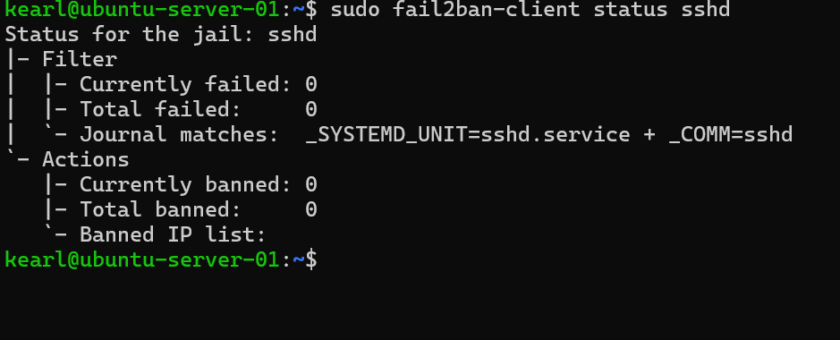
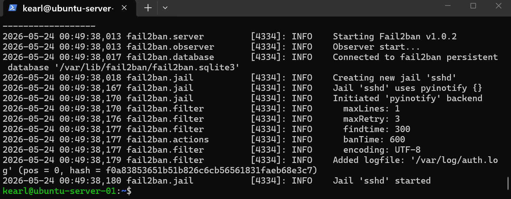
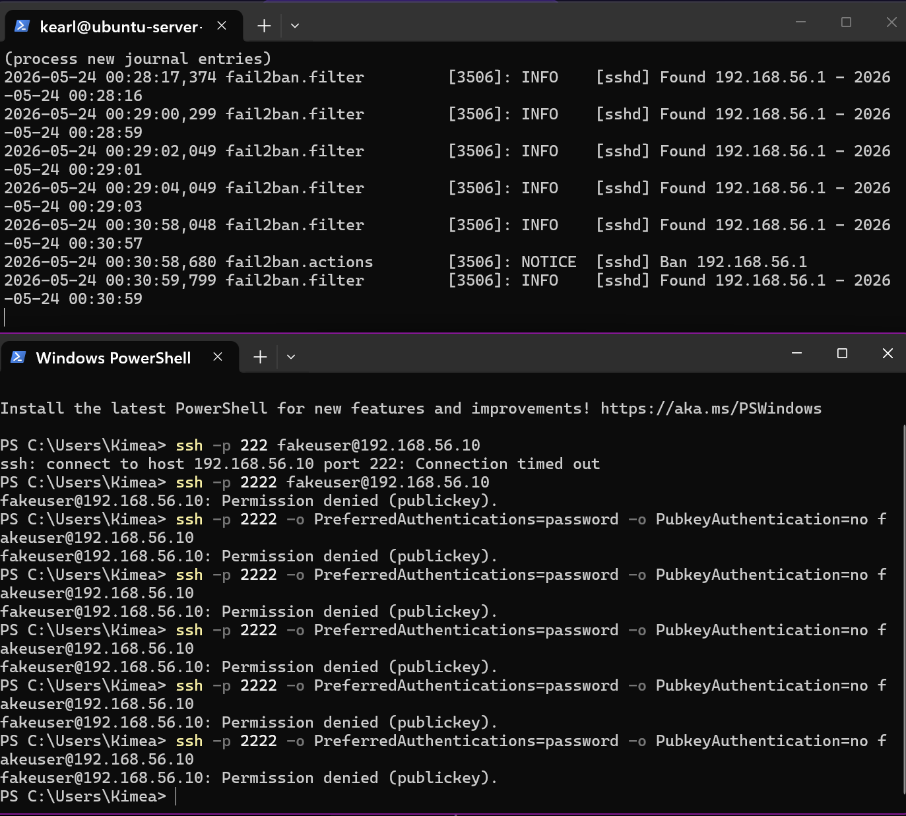
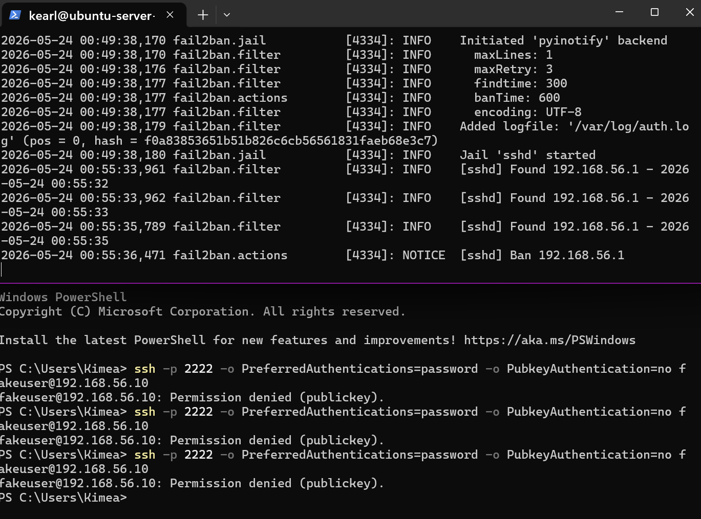

# Experiment 003 — fail2ban SSH Intrusion Prevention

## Overview
| Field | Details |
|---|---|
| **Experiment** | Exp003 |
| **Title** | fail2ban SSH Intrusion Prevention |
| **Date** | 2026-05-24 |
| **Status** | Complete |
| **System** | Ubuntu-Server-01 @ 192.168.56.10 |
| **Cert Connection** | Security+ / CySA+ |

---

## Objective
Deploy fail2ban on Ubuntu-Server-01 to automatically detect and block SSH brute force attempts in real time, adding a dynamic intrusion prevention layer on top of the static firewall rules from Exp001 and SSH hardening from Exp002.

---

## Why This Matters
Static firewall rules and SSH hardening reduce attack surface but don't respond to live threats. fail2ban watches log files in real time and automatically bans IPs that show brute force behavior. This is intrusion prevention in action — a core SOC concept that maps directly to:
- **Security+** — Intrusion prevention systems (IPS), log monitoring
- **CySA+** — Threat detection, incident response, automated defensive action

### UFW vs fail2ban
| Tool | Type | What It Does |
|---|---|---|
| UFW | Static | Blocks IPs defined ahead of time |
| fail2ban | Dynamic | Watches logs and bans IPs based on live behavior |

---

## Installation

```bash
sudo apt update && sudo apt install fail2ban -y
```

Installed packages:
- `fail2ban` — main intrusion prevention tool
- `python3-pyinotify` — watches log files in real time for changes
- `python3-pyasyncore` — handles async I/O for log event processing
- `whois` — IP lookup support

---

## Configuration

Never edit `jail.conf` directly — it gets overwritten on updates. Always use `jail.local`:

```bash
sudo cp /etc/fail2ban/jail.conf /etc/fail2ban/jail.local
sudo nano /etc/fail2ban/jail.local
```

Custom sshd jail configuration:

```ini
[sshd]
enabled = true
port = 2222
logpath = /var/log/auth.log
maxretry = 3
bantime = 600
findtime = 300
```

| Setting | Value | Meaning |
|---|---|---|
| port | 2222 | Custom SSH port from Exp002 |
| logpath | /var/log/auth.log | Where SSH login attempts are logged |
| maxretry | 3 | Ban after 3 failed attempts |
| bantime | 600 | Ban lasts 10 minutes (600 seconds) |
| findtime | 300 | Count attempts within 5 minute window |

---

## Verification

```bash
sudo fail2ban-client status sshd
```



Log confirmed:
```
maxRetry: 3
findtime: 300
banTime: 600
Added logfile: '/var/log/auth.log'
Jail 'sshd' started
```



---

## Live Ban Test

Triggered ban from Windows host (192.168.56.1) using forced password auth:

```powershell
ssh -p 2222 -o PreferredAuthentications=password -o PubkeyAuthentication=no fakeuser@192.168.56.10
```

Result from fail2ban.log:
```
00:55:32 - Found 192.168.56.1  (attempt 1)
00:55:33 - Found 192.168.56.1  (attempt 2)
00:55:35 - Found 192.168.56.1  (attempt 3)
00:55:36 - NOTICE [sshd] Ban 192.168.56.1
```





Ban fired on exactly the 3rd attempt within 4 seconds.

**Note:** The ban dropped the active SSH session — all connections from a banned IP are terminated immediately including existing sessions. Recovery required direct console access to unban.

Unban command:
```bash
sudo fail2ban-client set sshd unbanip 192.168.56.1
```

Final status:
- Currently banned: 0
- Total banned: 1 (recorded in persistent SQLite database)

---


## Lessons Learned
- fail2ban adds dynamic threat response on top of static firewall rules
- Always use `jail.local` not `jail.conf` for custom config — jail.conf gets overwritten on updates
- Always test config with `fail2ban-server --test` before restarting
- A banned IP loses all access immediately including active sessions — have console access ready
- Persistent SQLite database survives restarts and tracks full ban history
- fail2ban's `ignoreself` rule prevents banning localhost — attacks must come from an external IP

---

## Defense Layers After Exp003

| Layer | Tool | What It Does |
|---|---|---|
| 1 | pfSense Firewall (Exp001) | Default deny, specific allow rules |
| 2 | SSH Hardening (Exp002) | Port 2222, key auth only, no root, no passwords |
| 3 | fail2ban (Exp003) | Dynamic blocking — bans IPs after 3 failed attempts |

---

## Cert Connections
| Cert | Domain | Topic |
|---|---|---|
| Security+ | Threats, Attacks & Vulnerabilities | Intrusion prevention, log monitoring |
| CySA+ | Security Operations | Threat detection, automated defensive response |

## Related Experiments

- [Exp001 — pfSense Firewall Rules](../Exp001/exp001-pfsense-firewall-rules.md)
- [Exp002 — SSH Hardening](../Exp002/exp002-ssh-hardening.md)
- [Exp004 — Splunk SIEM](../Exp004/exp004-splunk-siem.md)
- [Exp005 — Nessus Vulnerability Scan](../Exp005/exp005-nessus-vulnerability-scan.md)
- [Exp006 — Active Directory](../Exp006/exp006-active-directory.md)