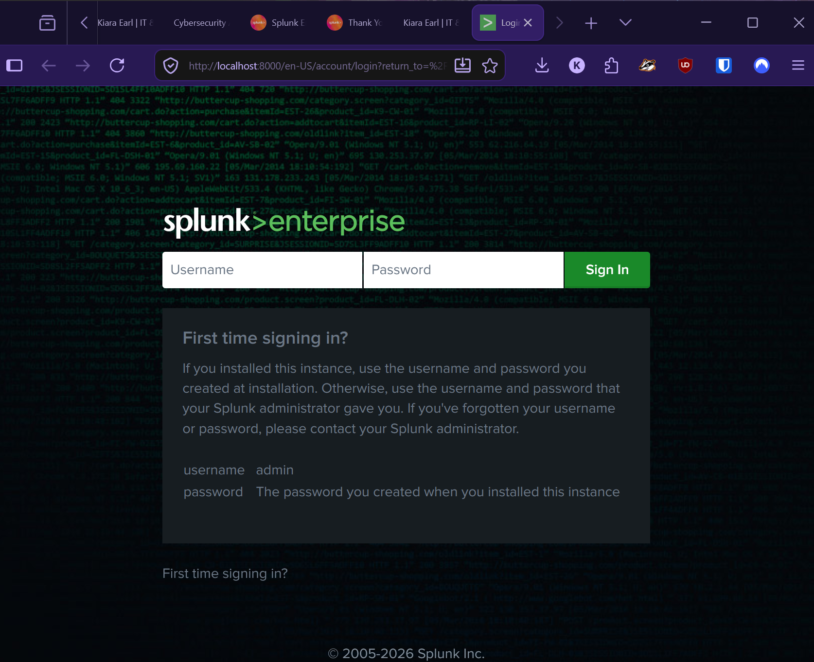
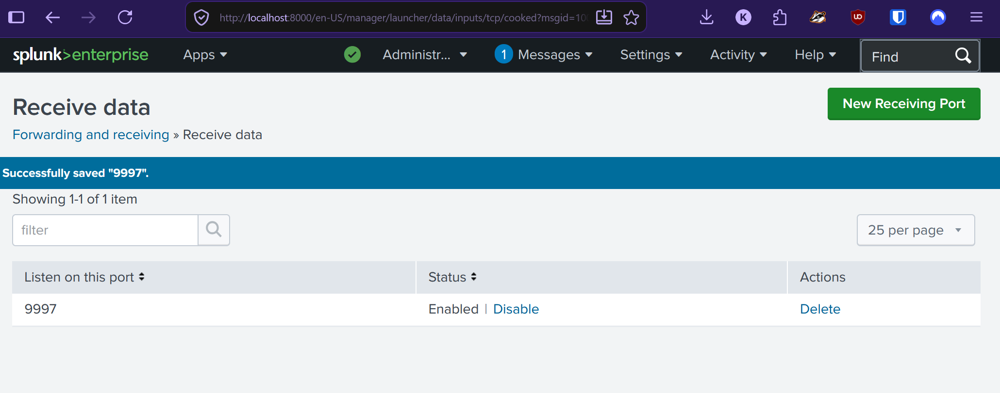
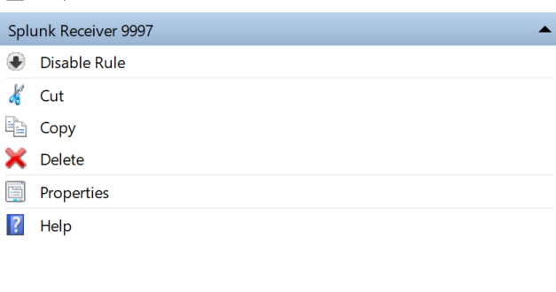
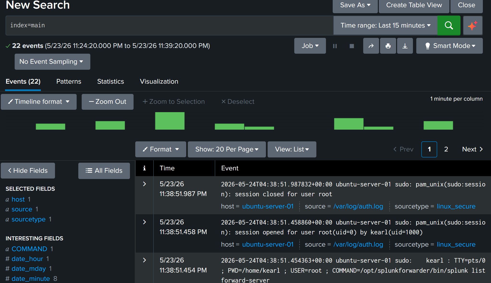
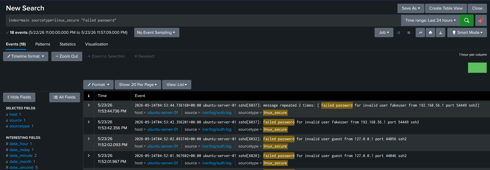
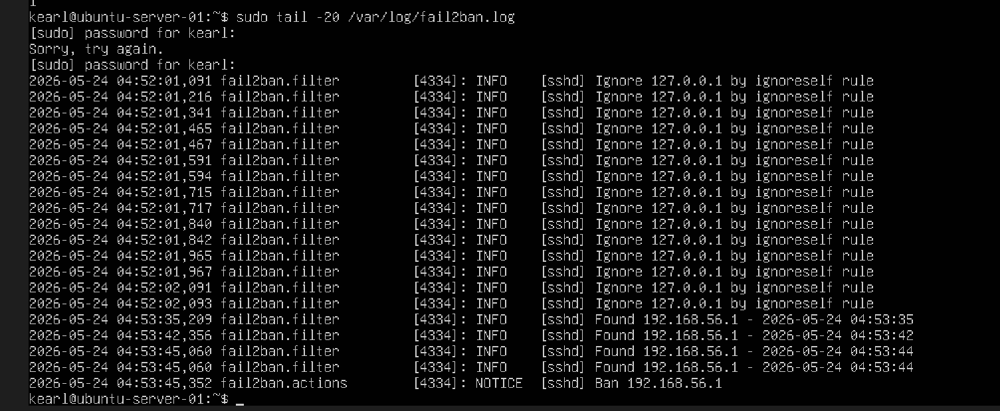
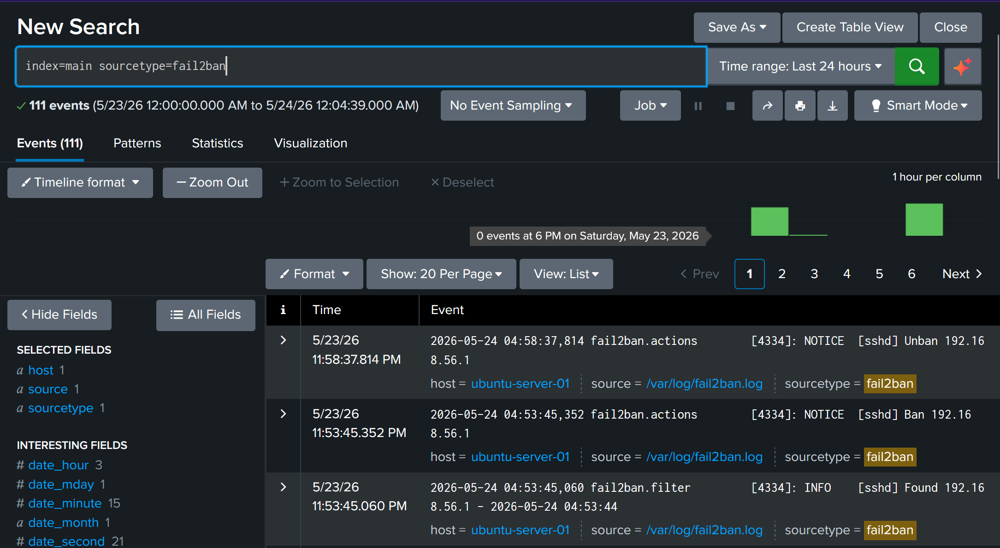
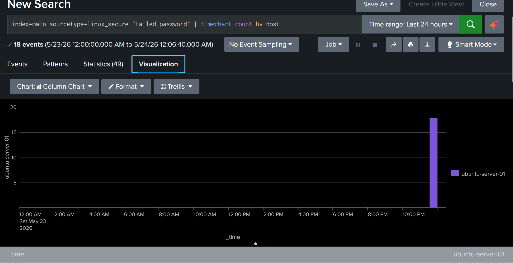
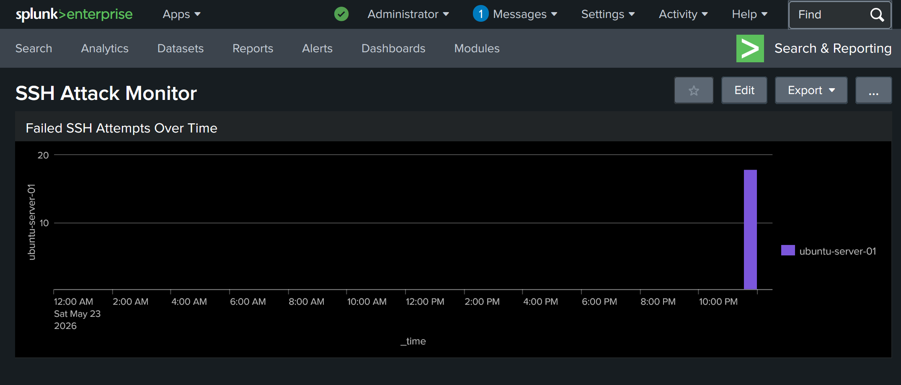
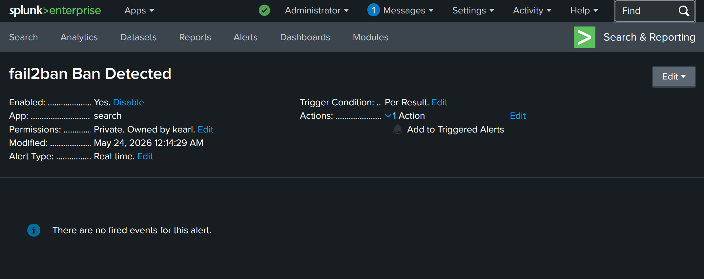

# Experiment 004 — Splunk SIEM Log Ingestion

## Overview
| Field | Details |
|---|---|
| **Experiment** | Exp004 |
| **Title** | Splunk SIEM Log Ingestion |
| **Date** | 2026-05-24 |
| **Status** | Complete |
| **Systems** | Ubuntu-Server-01 → Windows Host |
| **Cert Connection** | Security+ / CySA+ |

---

## Objective
Deploy Splunk Enterprise on the Windows host and configure a Universal Forwarder on Ubuntu-Server-01 to ship auth.log and fail2ban.log into Splunk for real-time monitoring, dashboarding, and alerting. Build a complete SOC-style detection pipeline from log source to alert.

---

## Why This Matters
SIEM (Security Information and Event Management) is the core tool of any SOC. Analysts use SIEMs to collect logs from across the environment, detect threats, investigate incidents, and generate alerts. Splunk is the industry-leading SIEM and appears on nearly every SOC job posting. This experiment maps directly to:
- **Security+** — Log management, SIEM, monitoring and alerting
- **CySA+** — Threat and vulnerability management, security monitoring, incident detection

---

## Architecture

```
Ubuntu-Server-01 (192.168.56.10)
  └── Splunk Universal Forwarder
        └── ships logs on port 9997
              └── Windows Host (192.168.56.1)
                    └── Splunk Enterprise (localhost:8000)
```

---

## Components Installed

| Component | Version | Location | Purpose |
|---|---|---|---|
| Splunk Enterprise | 10.4.0 | Windows Host | SIEM — receives, indexes, visualizes logs |
| Splunk Universal Forwarder | 10.4.0 | Ubuntu-Server-01 | Ships log files to Splunk |

---

## Configuration

### Splunk Enterprise (Windows)
- Installed to: C:\Program Files\Splunk
- Web UI: http://localhost:8000
- Receiving port: 9997
- Windows Firewall rule added: Splunk Receiver 9997 (TCP inbound)
- Credentials: [see Bitwarden — "Splunk Enterprise - Home Lab"]







### Universal Forwarder (Ubuntu)
- Installed to: /opt/splunkforwarder
- Forward server: 192.168.56.1:9997
- Runs as system user: splunkfwd
- Credentials: [see Bitwarden — "Splunk Forwarder - Ubuntu"]

### Log Files Monitored
| File | Sourcetype | Contents |
|---|---|---|
| /var/log/auth.log | linux_secure | SSH login attempts, sudo usage, auth events |
| /var/log/fail2ban.log | fail2ban | Ban/unban events, detected intrusion attempts |

---

## Brute Force Simulation

Temporarily enabled password authentication to generate real attack data:

```bash
sudo sed -i 's/PasswordAuthentication no/PasswordAuthentication yes/' /etc/ssh/sshd_config
sudo sed -i 's/PasswordAuthentication no/PasswordAuthentication yes/' /etc/ssh/sshd_config.d/50-cloud-init.conf
sudo systemctl restart ssh
```

Simulated brute force from Windows host (192.168.56.1):

```powershell
for ($i=1; $i -le 3; $i++) { ssh -p 2222 -o PreferredAuthentications=password fakeuser@192.168.56.10 }
```

Result:
- 3 failed password attempts logged to auth.log
- fail2ban detected attempts and banned 192.168.56.1
- Ban event shipped to Splunk via forwarder









Re-hardened immediately after test:
```bash
sudo sed -i 's/PasswordAuthentication yes/PasswordAuthentication no/' /etc/ssh/sshd_config
sudo sed -i 's/PasswordAuthentication yes/PasswordAuthentication no/' /etc/ssh/sshd_config.d/50-cloud-init.conf
sudo systemctl restart ssh
```

---

## Splunk Queries Used

```splunk
# All incoming events
index=main

# Failed SSH login attempts
index=main sourcetype=linux_secure "Failed password"

# fail2ban events (bans, unbans, detections)
index=main sourcetype=fail2ban

# Failed SSH attempts over time (dashboard query)
index=main sourcetype=linux_secure "Failed password" | timechart count by host
```

---

## Dashboard Built
- **Name:** SSH Attack Monitor
- **Panel:** Failed SSH Attempts Over Time (Column Chart)
- Shows brute force spike at time of simulated attack





---

## Alert Created
- **Name:** fail2ban Ban Detected
- **Type:** Real-time
- **Trigger:** Per-Result — fires on every ban event
- **Severity:** High
- **Action:** Add to Triggered Alerts
- **Query:** `index=main sourcetype=fail2ban "Ban"`



---

## Lessons Learned
- Universal Forwarder is lightweight — runs silently on Ubuntu with no performance impact
- Port 9997 must be open on the receiving Splunk server — Windows Firewall rule required
- fail2ban's ignoreself rule prevents banning localhost — attacks must come from an external IP
- Ubuntu 24.04 has /etc/ssh/sshd_config.d/50-cloud-init.conf which overrides main sshd_config
- Splunk indexes data by sourcetype — labeling correctly at ingest makes searching much easier
- Real-time alerts in Splunk fire per event — useful for high-priority detections like bans

---

## Defense Layers After Exp004

| Layer | Tool | What It Does |
|---|---|---|
| 1 | pfSense Firewall (Exp001) | Default deny, specific allow rules |
| 2 | SSH Hardening (Exp002) | Port 2222, key auth only, no root, no passwords |
| 3 | fail2ban (Exp003) | Dynamic blocking — bans IPs after 3 failed attempts |
| 4 | Splunk SIEM (Exp004) | Real-time log ingestion, dashboards, and alerts |

---

## Cert Connections
| Cert | Domain | Topic |
|---|---|---|
| Security+ | Operations & Incident Response | SIEM, log management, monitoring |
| CySA+ | Security Operations | Threat detection, security monitoring, alerting |

## Related Experiments

- [Exp001 — pfSense Firewall Rules](../Exp001/exp001-pfsense-firewall-rules.md)
- [Exp002 — SSH Hardening](../Exp002/exp002-ssh-hardening.md)
- [Exp003 — fail2ban](../Exp003/exp003-fail2ban.md)
- [Exp005 — Nessus Vulnerability Scan](../Exp005/exp005-nessus-vulnerability-scan.md)
- [Exp006 — Active Directory](../Exp006/exp006-active-directory.md)