# Experiment 005 — Nessus Vulnerability Scan

## Overview
| Field | Details |
|---|---|
| **Experiment** | Exp005 |
| **Title** | Nessus Vulnerability Scan |
| **Date** | May 24, 2026 |
| **Status** | Complete |
| **Target** | Ubuntu-Server-01 @ 192.168.56.10 |
| **Tool** | Tenable Nessus Essentials Plus |
| **Cert Connection** | Security+ / CySA+ / Network+ |

---

## Objective
Run both an unauthenticated and a credentialed vulnerability scan against Ubuntu-Server-01 using Nessus Essentials Plus to validate the security hardening applied in Exp001 through Exp004. Identify any vulnerabilities, misconfigurations, or exposed attack surface, and document findings with remediation notes.

---

## Why This Matters
Vulnerability scanning is a core function of any SOC or security team. Tools like Nessus are used daily in enterprise environments to identify CVEs, patch gaps, and misconfigurations before attackers can exploit them. Running a scan against a system you have already hardened closes the loop — it validates that your controls actually work. This experiment directly maps to:
- **Security+** — Vulnerability scanning, patch management, attack surface reduction
- **CySA+** — Vulnerability management lifecycle, credentialed vs unauthenticated scans, remediation validation
- **Network+** — Port scanning, service detection, protocol analysis

---

## Environment
| Component | Details |
|---|---|
| Scanner Host | Windows 11 Pro (VirtualBox host) |
| Nessus Version | Essentials Plus 10.12.0 |
| Nessus URL | https://localhost:8834 |
| Target | Ubuntu-Server-01, 192.168.56.10 |
| Network | VirtualBox Host-Only (192.168.56.0/24) |
| SSH Port | 2222 (hardened in Exp002) |

---

## Tools Used
- Tenable Nessus Essentials Plus (free, unlimited IPs for verified students)
- OpenSSH (Ubuntu-Server-01)
- UFW (Ubuntu firewall)

---

## Scan 1 — Unauthenticated Basic Network Scan

### What We Did
Configured a Basic Network Scan in Nessus targeting 192.168.56.10 with no credentials. This simulates what an external attacker would see — only information visible from outside the system.

### Screenshot
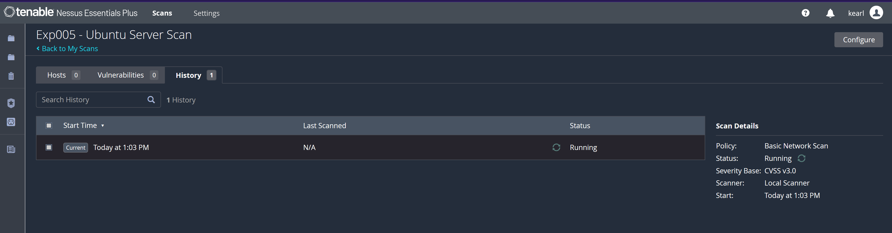
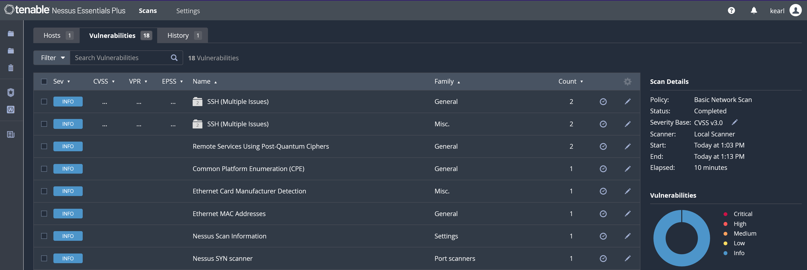

### Results
| Severity | Count |
|---|---|
| Critical | 0 |
| High | 0 |
| Medium | 0 |
| Low | 0 |
| Info | 18 |

**Zero exploitable vulnerabilities detected from the outside.**

### Key Findings Explained

| Finding | What It Means |
|---|---|
| SSH Protocol Versions Supported | SSH running on port 2222, protocol v2 only. Risk Factor: None. Confirms Exp002 hardening. |
| Remote Services Using Post-Quantum Ciphers | SSH is using modern post-quantum cipher `sntrup761x25519-sha512@openssh.com`. Informational only. |
| Backported Security Patch Detection (SSH) | Ubuntu applies security patches without changing version numbers. Could not verify without credentials. |
| Common Platform Enumeration (CPE) | Nessus identified the OS. Expected reconnaissance finding. |
| Ethernet MAC Addresses | Network interface detected. Informational. |

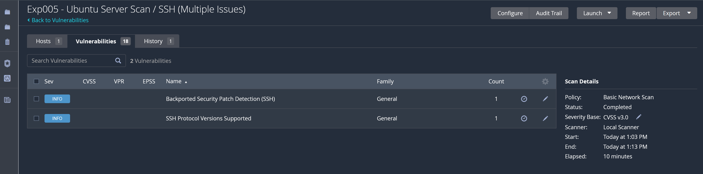

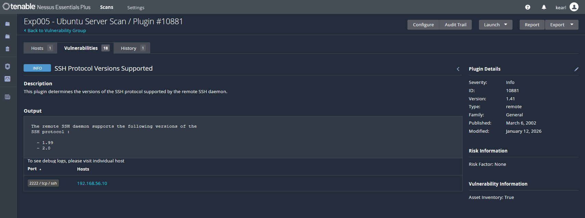

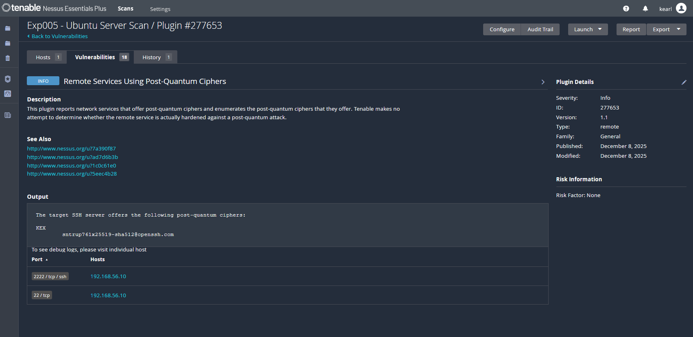

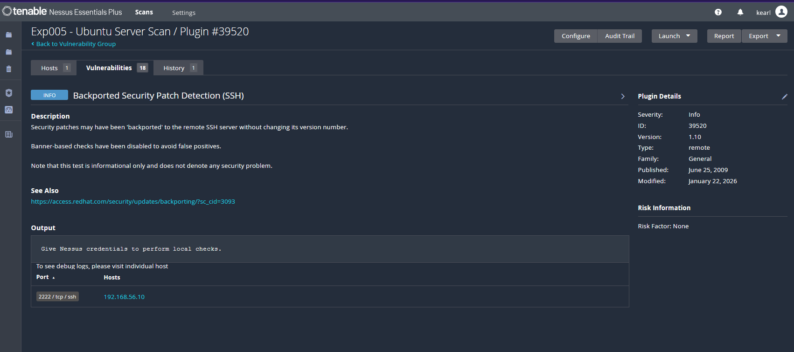

### Port 22 Investigation
Nessus detected activity on port 22 during the post-quantum cipher enumeration. Investigation confirmed:
- `sudo ss -tlnp | grep ssh` — SSH only listening on **port 2222**
- `sudo ufw status numbered` — UFW only allows **port 2222**, port 22 not present

**Conclusion:** Port 22 is not open. The detection was a scanner artifact from the SYN probe phase, not a real open port.

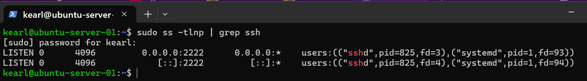

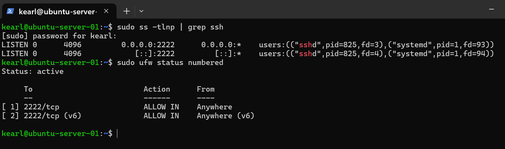

---

## Scan 2 — Credentialed Scan Attempt (ed25519 Key — Failed)

### What We Did
Added SSH credentials to the scan using our existing ed25519 private key to allow Nessus to log into the system and perform deep internal checks.

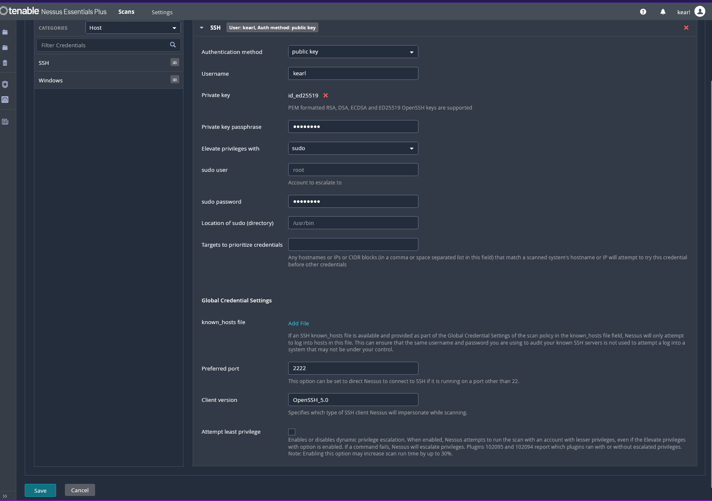

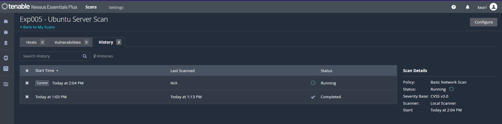

### Result
Authentication failed. Nessus reported:
> "Target Credential Status by Authentication Protocol - Failure for Provided Credentials"

### Root Cause
Nessus requires PEM/PKCS8 formatted keys. ED25519 keys generated by OpenSSH are not compatible with Nessus's SSH client implementation and cannot be converted to PKCS8 format.

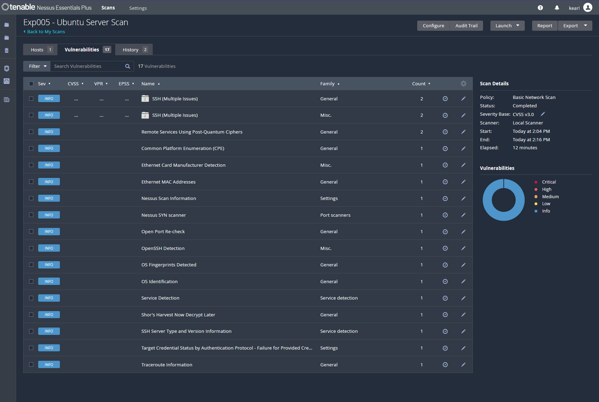

---

## Scan 3 — Credentialed Scan (RSA Key — Success)

### What We Did
Generated a dedicated RSA 4096-bit key pair specifically for Nessus scanning, following the enterprise practice of using separate service account credentials for scanner tools.

**Key generation:**
```powershell
ssh-keygen -t rsa -b 4096 -f C:\Users\Kimea\.ssh\id_rsa_nessus
```

**Added public key to Ubuntu authorized_keys:**
```powershell
type C:\Users\Kimea\.ssh\id_rsa_nessus.pub | ssh -p 2222 -i C:\Users\Kimea\.ssh\id_ed25519 kearl@192.168.56.10 "cat >> ~/.ssh/authorized_keys"
```

**Credential separation rationale:**
- `id_ed25519` + passphrase = personal admin key (protected, passphrase required)
- `id_rsa_nessus` = Nessus service account key (no passphrase, local scanner use only)

This mirrors real enterprise vulnerability management where scanner service accounts use dedicated credentials separate from administrator accounts.

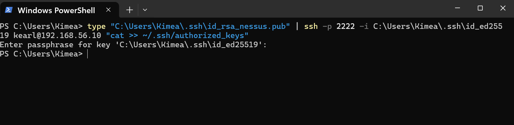

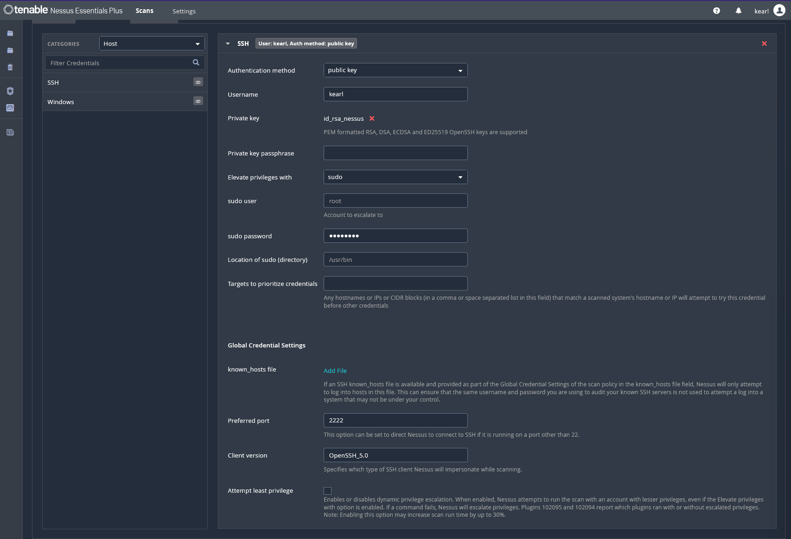

### Nessus Credential Configuration
| Setting | Value |
|---|---|
| Auth Method | Public Key |
| Username | kearl |
| Private Key | id_rsa_nessus |
| Passphrase | None |
| Elevate Privileges | sudo |
| Sudo User | root |
| Preferred Port | 2222 |

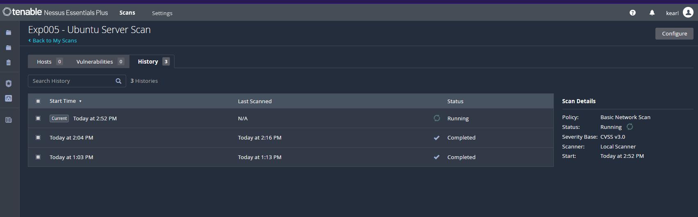

### Result — Success
Nessus confirmed successful authentication:
```
User:    'kearl'
Port:    2222
Proto:   SSH
```

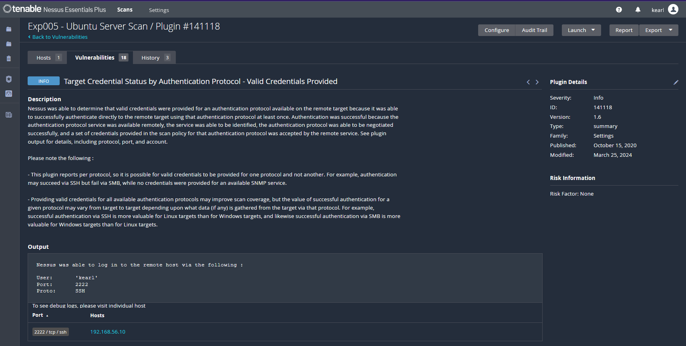

### Results
| Severity | Count |
|---|---|
| Critical | 0 |
| High | 0 |
| Medium | 0 |
| Low | 0 |
| Info | 18 |

**Zero exploitable vulnerabilities detected even with full internal access.**

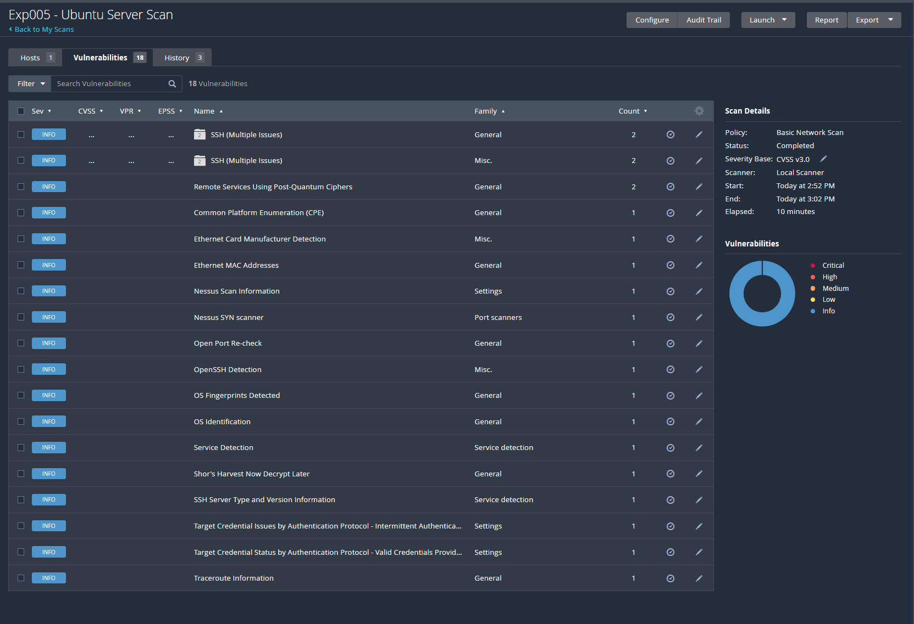

---

## Scan Comparison Summary

| Scan | Type | Auth | Result |
|---|---|---|---|
| Scan 1 | Unauthenticated | None | 18 INFO, 0 vulns |
| Scan 2 | Credentialed | ed25519 (failed) | Auth failure |
| Scan 3 | Credentialed | RSA 4096 (success) | 18 INFO, 0 vulns |

---

## Validation of Previous Experiments

| Experiment | Control Applied | Nessus Result |
|---|---|---|
| Exp001 — pfSense Firewall | Default deny, specific allows | No unexpected open ports detected |
| Exp002 — SSH Hardening | Port 2222, key auth, no root, no password | SSH on 2222 only, protocol v2, Risk Factor: None |
| Exp003 — fail2ban | Brute force protection | No auth-related vulnerabilities |
| Exp004 — Splunk SIEM | Log monitoring and alerting | N/A (monitoring layer) |

---

## Lessons Learned

1. **Unauthenticated vs credentialed scans** — Unauthenticated scans show the external attack surface. Credentialed scans reveal internal patch levels, configs, and package vulnerabilities. Both are necessary in a real vulnerability management program.

2. **Key format compatibility** — Nessus does not support ED25519 keys. RSA 4096 is the correct key type for Nessus service accounts. This is a real-world compatibility consideration when integrating scanners with hardened SSH configurations.

3. **Credential separation** — Using a dedicated RSA key for Nessus rather than the personal admin key is an enterprise best practice. Service accounts should have their own credentials scoped to their purpose.

4. **Scanner artifacts** — Nessus flagged port 22 during the post-quantum cipher enumeration. Investigating confirmed it was a scanner artifact, not a real open port. Analysts must verify findings rather than accepting scan output at face value.

5. **Clean scan validates hardening** — Zero critical/high/medium/low findings on a credentialed scan of a hardened system is the goal of a vulnerability management program. This result confirms the hardening applied across Exp001–Exp004 is effective.

---

## Cert Connections

| Cert | Domain | Topic |
|---|---|---|
| Security+ | Threats, Attacks & Vulnerabilities | Vulnerability scanning, patch management |
| CySA+ | Vulnerability Management | Credentialed scanning, remediation validation, scan comparison |
| Network+ | Network Security | Port scanning, service detection, firewall validation |

---

## Related Experiments

- [Exp001 — pfSense Firewall Rules](../Exp001/exp001-pfsense-firewall-rules.md)
- [Exp002 — SSH Hardening](../Exp002/exp002-ssh-hardening.md)
- [Exp003 — fail2ban](../Exp003/exp003-fail2ban.md)
- [Exp004 — Splunk SIEM](../Exp004/exp004-splunk-siem.md)
- [Exp006 — Active Directory](../Exp006/exp006-active-directory.md)
