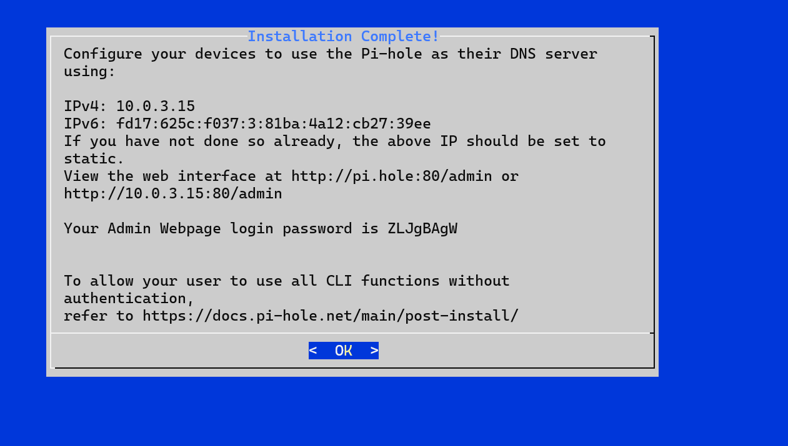
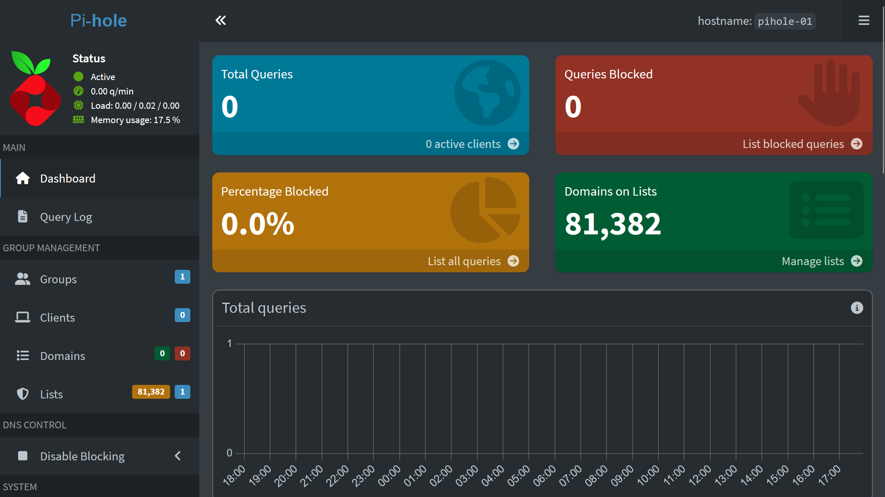
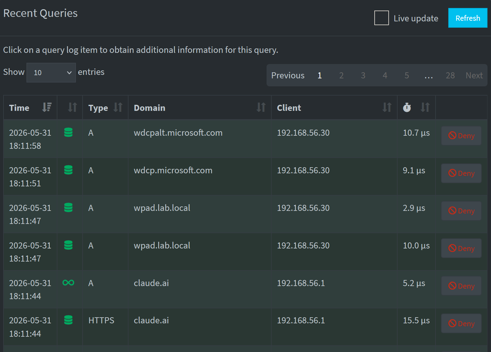

# Experiment 008 — Pi-hole DNS Sinkhole

## Overview
| | |
|---|---|
| **Date** | May 31, 2026 |
| **Status** | Complete |
| **Difficulty** | Beginner–Intermediate |
| **Time** | ~2 hours |
| **Platform** | VirtualBox (Ubuntu Server 24.04 VM) |

---

## Objective
Deploy Pi-hole as a network-wide DNS sinkhole in the homelab. Pi-hole intercepts DNS queries from all devices on the network and blocks requests to known ad, tracking, and malicious domains before they ever reach the endpoint. Configure it to monitor real DNS traffic across the lab network and whitelist trusted domains.

---

## Why This Matters
DNS sinkholes are a core defensive security technique used in enterprise SOC environments to block malicious domains at the network level. Understanding how DNS filtering works — and how to read query logs — is directly applicable to threat hunting, incident response, and network monitoring roles. Pi-hole gives hands-on experience with DNS architecture, blocklists, and traffic visibility across an entire network.

---

## Lab Environment
| Component | Value |
|---|---|
| **VM Name** | Pihole-01 |
| **OS** | Ubuntu Server 24.04.4 LTS |
| **IP Address** | 192.168.56.40 (static) |
| **RAM** | 1GB |
| **CPU** | 1 vCPU |
| **Storage** | 10GB |
| **Network** | Host-Only Adapter (enp0s3) + NAT (enp0s8, temporary for install) |
| **Admin Dashboard** | http://192.168.56.40/admin |
| **Upstream DNS** | Cloudflare (1.1.1.1) with DNSSEC |
| **Blocklist** | StevenBlack's Unified Hosts List (81,382 domains) |

---

## Tools Used
- **Pi-hole** — DNS sinkhole and network-wide ad blocker
- **Ubuntu Server 24.04** — lightweight VM host
- **VirtualBox** — VM platform
- **Cloudflare DNS (1.1.1.1)** — upstream DNS with DNSSEC

---

## Step-by-Step Walkthrough

### Step 1 — Create the VM in VirtualBox

1. Open VirtualBox → click **New**
2. Fill in:
   - **Name:** `Pihole-01`
   - **ISO:** `ubuntu-24.04.4-live-server-amd64.iso`
   - **Uncheck** Unattended Installation
3. Hardware:
   - **RAM:** 1024 MB
   - **CPU:** 1
4. Disk: **10 GB**
5. Click **Finish**

Before booting, go to **Settings → Network**:
- **Adapter 1:** Host-Only Adapter → VirtualBox Host-Only Ethernet Adapter

---

### Step 2 — Install Ubuntu Server

1. Boot the VM — select **Try or Install Ubuntu Server**
2. Follow the installer:
   - Language: English
   - Base: **Ubuntu Server** (not minimized)
3. On the **Network Configuration** screen:
   - Select **enp0s3** → Edit IPv4 → Manual
   - **Subnet:** `192.168.56.0/24`
   - **Address:** `192.168.56.40`
   - **Gateway:** `192.168.56.2`
   - **Name servers:** `192.168.56.20`
   - Search domains: leave empty
4. Mirror: click **Done** (mirror unavailable — Host-Only has no internet, that's expected)
5. Storage: use entire disk — accept defaults
6. Profile setup:
   - **Name:** Kiara Earl
   - **Server name:** `pihole-01`
   - **Username:** `kearl`
   - **Password:** your lab password
7. SSH: check **Install OpenSSH server**
8. Snaps: skip
9. Let installation complete → remove ISO → press Enter to reboot

---

### Step 3 — Add Temporary NAT Adapter for Installation

Pi-hole needs internet access to download its packages. Since Pihole-01 is on Host-Only only, add a temporary second adapter:

1. Power off Pihole-01
2. **VirtualBox → Pihole-01 → Settings → Network → Adapter 2**
3. Check **Enable Network Adapter**
4. **Attached to:** NAT
5. Start Pihole-01 and SSH in:

```bash
ssh kearl@192.168.56.40
```

Bring up the NAT adapter and get a DHCP address:

```bash
sudo ip link set enp0s8 up
sudo networkctl up enp0s8
```

Verify it got an IP (should be 10.0.3.x):

```bash
ip addr show enp0s8
```

Delete the Host-Only default route so traffic goes through NAT:

```bash
sudo ip route del default via 192.168.56.2 dev enp0s3
```

---

### Step 4 — Install Pi-hole

Run the Pi-hole installer through the NAT interface:

```bash
curl --interface enp0s8 -sSL https://install.pi-hole.net | bash
```

> **Note:** Must use `--interface enp0s8` to force traffic through the NAT adapter. Without this, curl fails to connect even though ping works.

The installer will launch a terminal GUI. Work through each screen:

| Screen | Selection |
|---|---|
| Welcome | OK |
| Static IP | Continue (already set) |
| Interface | enp0s3 (Host-Only adapter) |
| Upstream DNS | Cloudflare (DNSSEC) |
| Blocklists | Yes — StevenBlack's Unified Hosts List |
| Admin web interface | Yes |
| Web server | Yes |
| Query logging | Yes |
| Privacy mode | 0 — Show everything |

Installation completes with your admin password displayed. Write it down.



---

### Step 5 — Change Admin Password

The auto-generated password is random. Set one you'll remember:

```bash
sudo pihole setpassword
```

> **Note:** On Ubuntu 24.04 you must use `sudo` for pihole commands.

---

### Step 6 — Access the Dashboard

On any device in the lab network open a browser and go to:

```
http://192.168.56.40/admin
```

Log in with your password. You'll see:
- **Status:** Active
- **Domains on Lists:** 81,382
- **Query Log:** live DNS traffic from all clients



---

### Step 7 — Point Lab Devices to Pi-hole

To have Pi-hole filter traffic from WS01:

1. On WS01 go to **Settings → Network & Internet → Ethernet → Edit**
2. Change **DNS** from `192.168.56.20` to `192.168.56.40`
3. Save

WS01 will now appear in the Pi-hole query log as client `192.168.56.30`.



---

### Step 8 — Whitelist Trusted Domains (Optional)

If Pi-hole blocks domains you need, whitelist them in the dashboard:

1. **Domains → Add domain → Whitelist**
2. Domains whitelisted during this lab:
   - `youtube.com`
   - `googlevideo.com`
   - `ytimg.com`
   - `ggpht.com`

Flush DNS cache after whitelisting:

```powershell
ipconfig /flushdns
```

---

## Verification

| Check | Result |
|---|---|
| Pi-hole dashboard accessible at 192.168.56.40/admin | Pass |
| Status shows Active | Pass |
| 81,382 domains on blocklist | Pass |
| Query log showing traffic from WS01 (192.168.56.30) | Pass |
| Query log showing traffic from host (192.168.56.1) | Pass |
| YouTube domains whitelisted and functional | Pass |

---

## Troubleshooting Notes

| Issue | Fix |
|---|---|
| `curl: Failed to connect to install.pi-hole.net` | Add NAT adapter, bring up enp0s8 with `sudo networkctl up enp0s8`, delete Host-Only default route, then use `curl --interface enp0s8` |
| `sudo: dhclient: command not found` | Ubuntu 24.04 uses networkctl instead of dhclient |
| `pihole: command not found` | Use `sudo pihole` — elevated privileges required on Ubuntu |
| Mirror unavailable during install | Expected — Host-Only has no internet. Click Done and continue |

---

## Key Concepts

**DNS Sinkhole** — intercepts DNS queries and returns a blocked response (NXDOMAIN or 0.0.0.0) for domains on the blocklist instead of the real IP. The device never connects to the blocked domain.

**Upstream DNS** — when Pi-hole doesn't have an answer (domain not blocked), it forwards the query to Cloudflare (1.1.1.1) which resolves it and returns the result.

**DNSSEC** — cryptographic verification that DNS responses haven't been tampered with in transit. Cloudflare with DNSSEC adds an extra layer of integrity to DNS resolution.

**Blocklist** — a curated list of known ad, tracking, and malicious domains. StevenBlack's list is community-maintained and updated regularly. Pi-hole supports multiple lists simultaneously.

---

## What I Learned

- DNS filtering happens before any connection is made — it's a lightweight, effective defense layer
- Pi-hole requires a static IP to function reliably as a DNS server
- On Ubuntu 24.04, `dhclient` is replaced by `networkctl` for DHCP management
- Pihole CLI commands require `sudo` on Ubuntu
- YouTube ad domains are served from the same CDN as video content — DNS-level blocking alone can't block YouTube ads without breaking video playback
- The query log gives full visibility into every DNS request across the network — a powerful tool for identifying suspicious activity

---

## Cert Connections

| Cert | Relevance |
|---|---|
| **CompTIA Network+** | DNS architecture, DNS filtering, network traffic analysis |
| **CompTIA Security+** | DNS sinkholes, network defense, malware domain blocking |
| **CompTIA CySA+** | Threat hunting via DNS logs, detecting C2 beaconing |

---

## Related Experiments

- [Exp001 — pfSense Firewall Rules](../Exp001/exp001-pfsense-firewall-rules.md)
- [Exp002 — SSH Hardening](../Exp002/exp002-ssh-hardening.md)
- [Exp003 — fail2ban](../Exp003/exp003-fail2ban.md)
- [Exp004 — Splunk SIEM](../Exp004/exp004-splunk-siem.md)
- [Exp005 — Nessus Vulnerability Scan](../Exp005/exp005-nessus-vulnerability-scan.md)
- [Exp006 — Active Directory](../Exp006/exp006-active-directory.md)
- [Exp007 — Microsoft Azure + Sentinel](../Exp007/exp007-azure-sentinel.md)
- [Exp012 — IAM Access Request Workflow](../Exp012/exp012-IAM-Access-Workflow.md)
