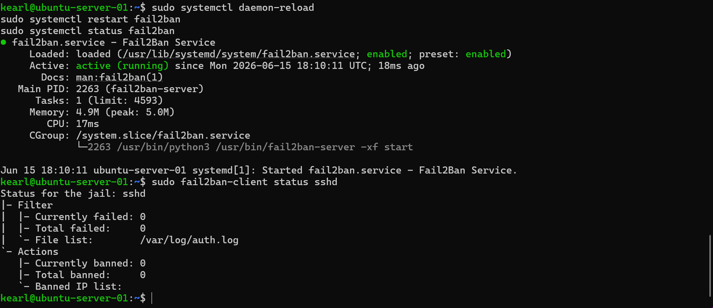

# RUNBOOK: fail2ban Service Restart (Ubuntu-Server-01)

**Runbook ID:** RB-009-01
**System:** Ubuntu-Server-01 (192.168.56.10)
**Service:** fail2ban
**Risk Level:** Low (standard restart, no config changes required by this runbook)
**Estimated Time:** 2-3 minutes
**Owner:** Tier 1 CIC Analyst

---

## When to Use This Runbook
- fail2ban service shows as inactive/failed in monitoring
- A jail configuration change has been applied and needs to take effect
- fail2ban is not banning IPs as expected and a restart is the first remediation step

## Prerequisites
- SSH access to Ubuntu-Server-01
- Credentials stored in Bitwarden under "Ubuntu-Server-01"

---

## Steps

1. **Connect to the server via SSH**
*Expected result:* You are logged into a shell prompt as `kearl@ubuntu-server-01`.

2. **Check current fail2ban status**
*Expected result:* Output shows `Active: active (running)` or `Active: inactive (dead)` / `failed`.

3. **Reload systemd and restart the fail2ban service**
*Expected result:* No output (success is silent).

4. **Verify the service is running**
*Expected result:* `Active: active (running)` shown in green.

5. **Verify the jail is active**
*Expected result:* Output shows `Status for the jail: sshd` with `Currently banned` and `Total banned` counts.

6. **Log the action**
   - Update the ticket/incident record with: "fail2ban service restarted on Ubuntu-Server-01. Service confirmed active, sshd jail confirmed running."

---

## Escalation Trigger
If after Step 4 the service shows `failed` or `inactive`, **do not attempt further troubleshooting**. Escalate to Tier 2 with:
- Output of `sudo systemctl status fail2ban`
- Output of `sudo journalctl -u fail2ban -n 50 --no-pager` (last 50 log lines)

## Rollback
Not applicable — this runbook only restarts the service and does not modify configuration. If the restart causes unexpected behavior, escalate per the trigger above.

---

## Related Documentation
- [Exp003: fail2ban Intrusion Prevention](../Exp003-Fail2Ban-Intrusion-Prevention/exp003-fail2ban.md) — initial configuration and jail setup
- [Exp009: CIC Incident Operations](./) — SITREP referencing this runbook