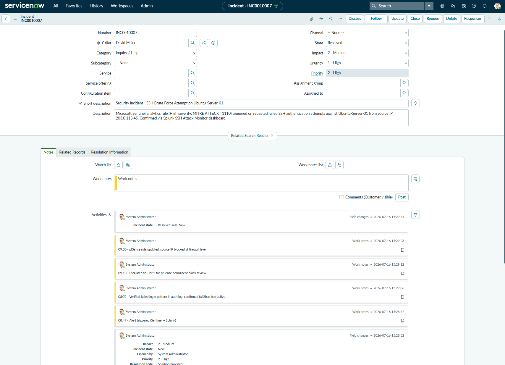

# SITUATION REPORT (SITREP)

**Incident #:** INC0010007
**Date/Time:** 2026-06-15 09:00 EST
**Prepared by:** Kiara Earl, Tier 1 CIC Analyst
**Classification:** Security Incident — Brute Force Authentication Attempt

---

## 1. Situation
Microsoft Sentinel analytics rule (High severity, MITRE ATT&CK T1110 - Brute Force) triggered on 2026-06-15 at approximately 08:47 EST. Splunk SSH Attack Monitor dashboard concurrently flagged repeated failed authentication attempts against Ubuntu-Server-01 (192.168.56.10) from source IP 203.0.113.45.

## 2. Impact
- Affected system: Ubuntu-Server-01 (SSH service, port 2222)
- No successful authentication observed
- No service disruption to dependent systems
- fail2ban triggered automatic ban of source IP per existing jail configuration

## 3. Actions Taken

| Time | Action |
|------|--------|
| 08:47 | Alert triggered (Sentinel + Splunk) |
| 08:50 | Tier 1 acknowledged, opened INC0010007 |
| 08:55 | Verified failed login pattern in auth.log; confirmed fail2ban ban active |
| 09:10 | Escalated to Tier 2 for pfSense permanent block review |
| 09:30 | pfSense rule updated — source IP blocked at firewall level |
| 09:35 | Confirmed no further auth attempts; incident resolved |

## 4. Current Status
**Resolved.** Source IP blocked at perimeter (pfSense) in addition to host-level fail2ban ban. No data compromise. Monitoring continues for repeat activity from related IP ranges.

## 5. Next Steps / Follow-up
- Monitor Splunk dashboard for 24 hours for related activity
- Review fail2ban ban duration policy — consider permanent block list for repeat offenders
- Update incident record with final resolution notes and close
