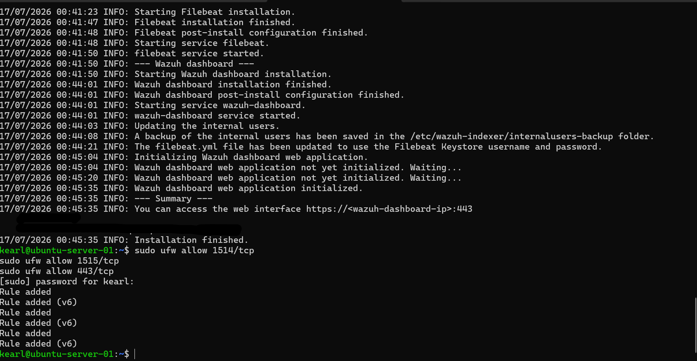
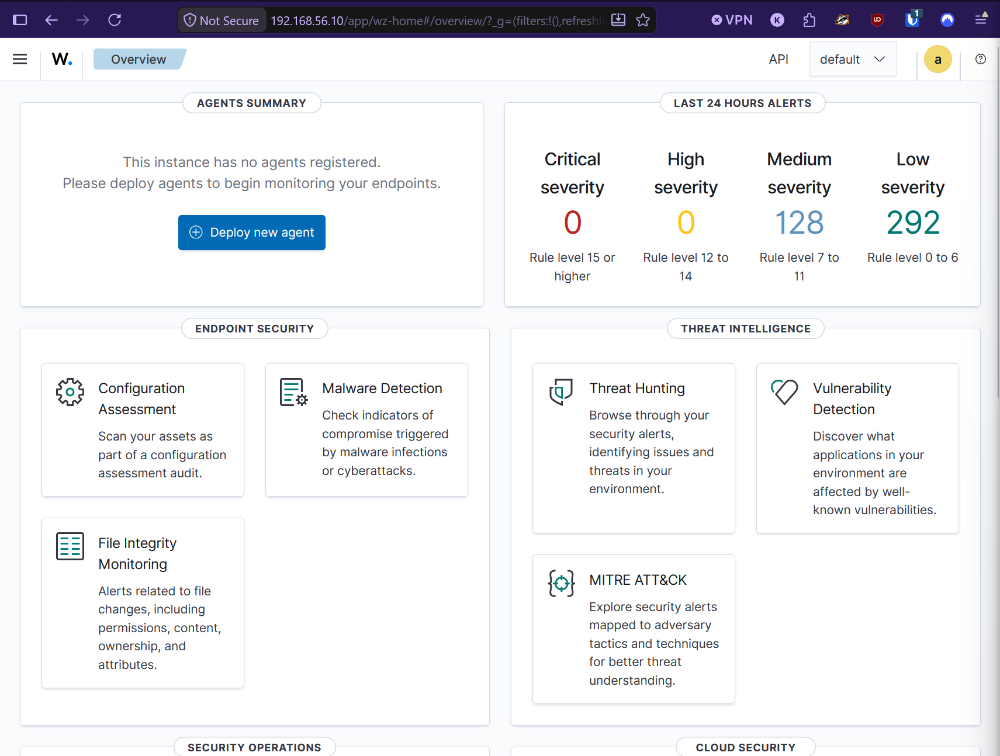
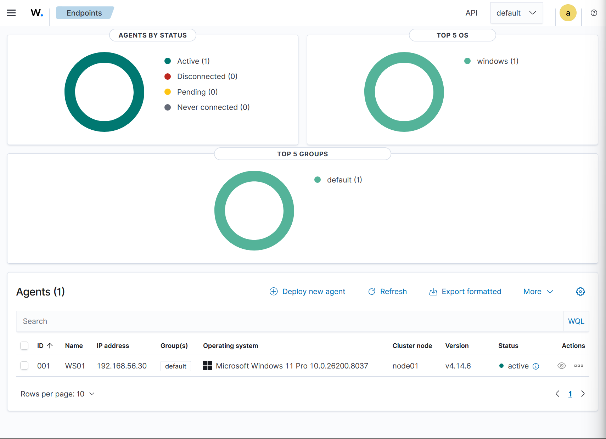
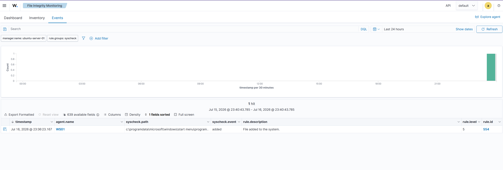
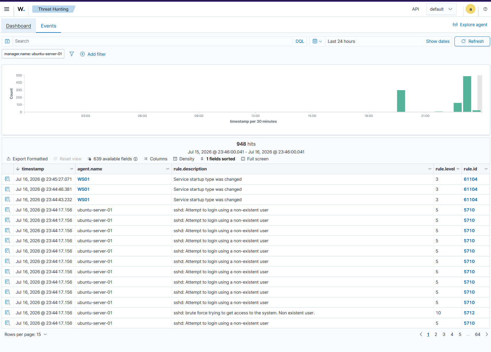
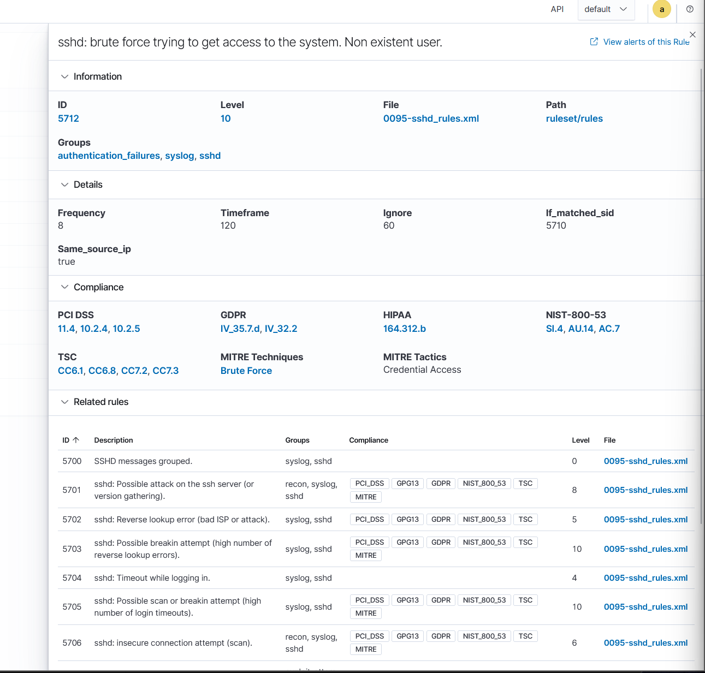
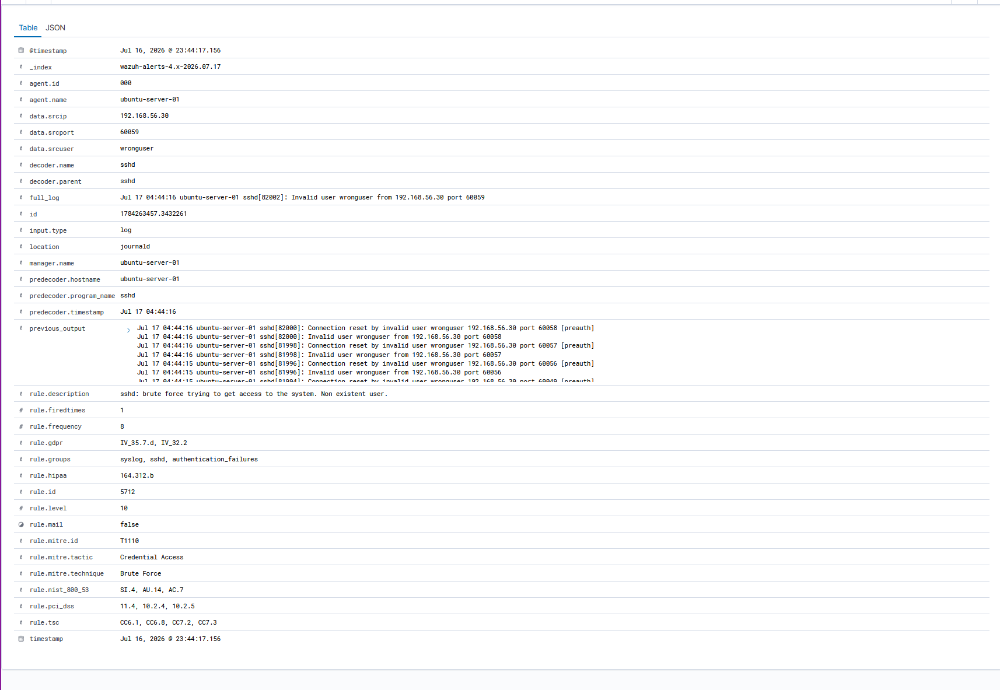
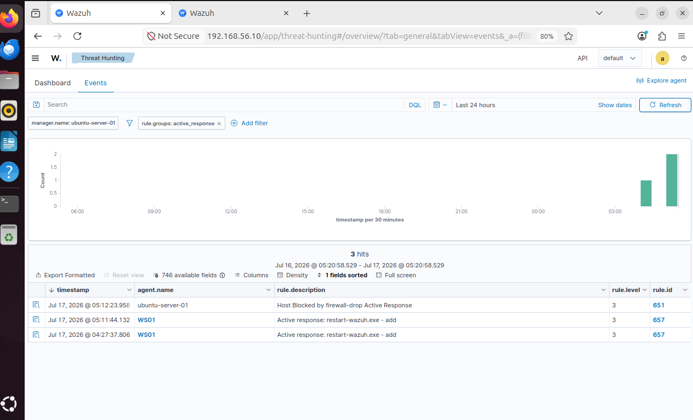
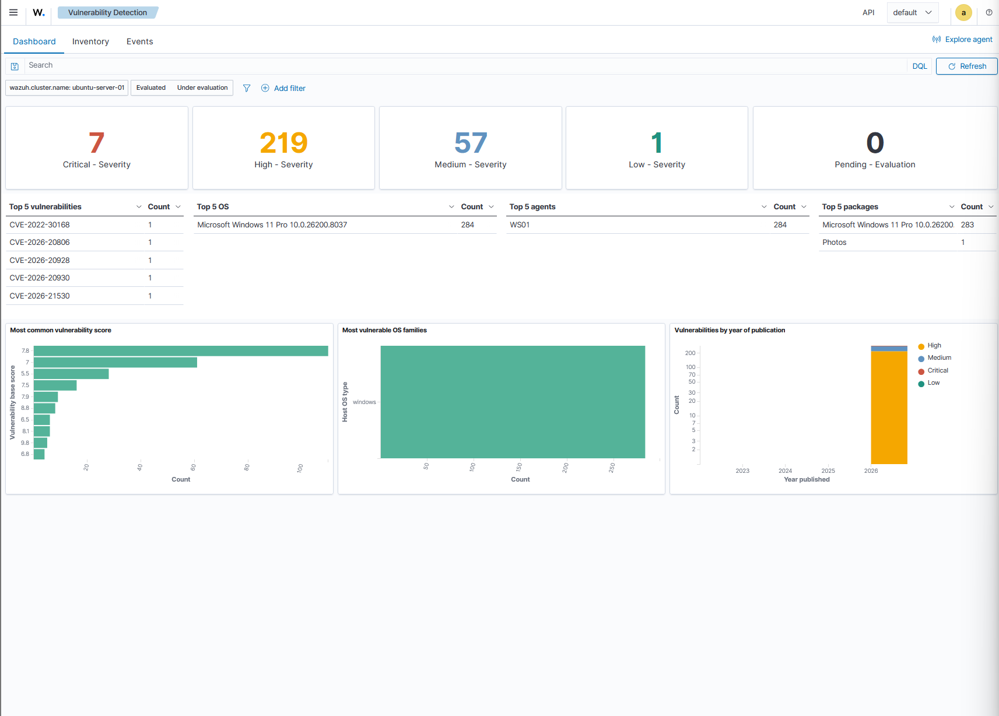
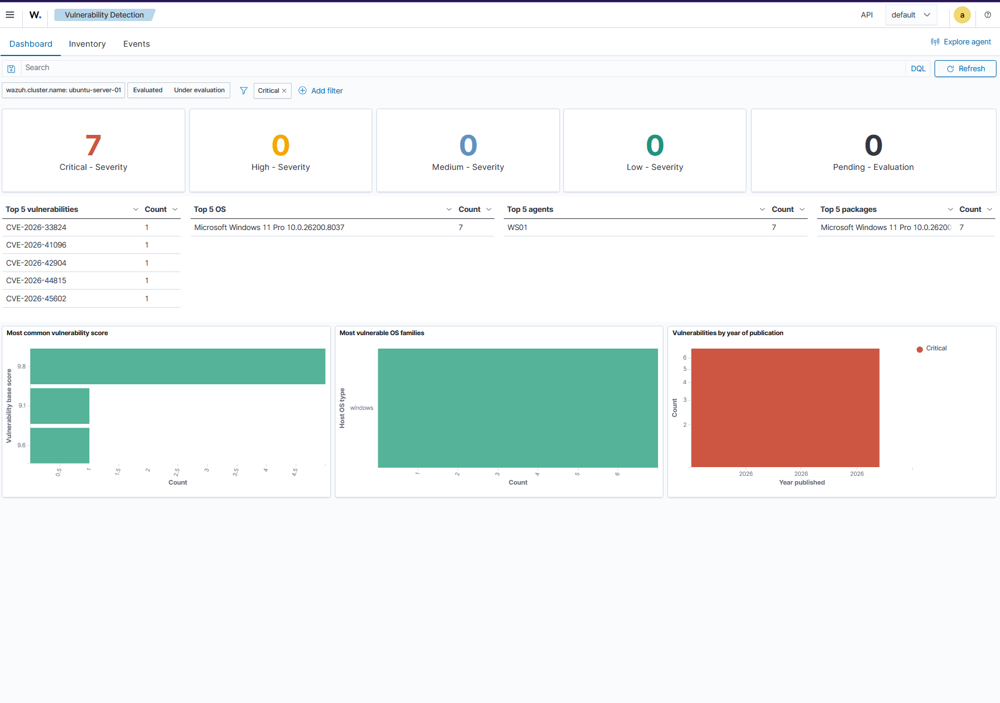

# Experiment 010: Wazuh EDR Deployment

## Objective

Deploy Wazuh as an open-source Endpoint Detection and Response (EDR) platform in the homelab, enroll both a Linux and a Windows endpoint as monitored agents, and validate core EDR capabilities: File Integrity Monitoring (FIM), brute-force attack detection, automated Active Response, and vulnerability detection. This experiment maps directly to EDR/MDR platform experience commonly listed in SOC analyst job postings, and complements the detection stack built in Exp003 (fail2ban), Exp004 (Splunk), and Exp007 (Microsoft Sentinel) by adding a dedicated, self-hosted EDR layer.

## Environment

- **Manager/Server:** Ubuntu-Server-01 (192.168.56.10) — all-in-one Wazuh deployment (manager, indexer, dashboard on a single host)
- **Agent 1:** Ubuntu-Server-01 itself, self-monitored via the manager's built-in local agent (Agent 000)
- **Agent 2:** Win11-Workstation-01 / "WS01" (192.168.56.30) — Windows 11 Pro endpoint
- **Wazuh version:** 4.14.6
- **Access:** Dashboard at `https://192.168.56.10`

## What Is Wazuh?

Wazuh is a free, open-source EDR/XDR platform that provides host-based monitoring across a fleet of endpoints. Core capabilities include:

- **File Integrity Monitoring (FIM)** — detects unauthorized file/registry changes in real time
- **Log analysis** — centralized log collection and correlation
- **Vulnerability detection** — scans installed software against known CVEs
- **Active Response** — automated remediation (e.g., firewall-blocking an attacking IP)
- **Compliance mapping** — built-in PCI DSS, GDPR, HIPAA, NIST 800-53 tagging on alerts
- **MITRE ATT&CK mapping** — alerts are tagged with corresponding tactics/techniques

It serves as a free alternative to commercial EDR tools like CrowdStrike or SentinelOne, giving direct hands-on experience with the same category of tool referenced in SOC job postings.

## Steps Performed

### Step 1 — Install Wazuh (All-in-One)

Downloaded and ran the official Wazuh installation assistant on Ubuntu-Server-01:

```bash
curl -sO https://packages.wazuh.com/4.14/wazuh-install.sh
sudo bash ./wazuh-install.sh -a
```

This installs the Wazuh manager, indexer (OpenSearch-based), and dashboard on a single host. Installation took several attempts due to issues detailed in the Troubleshooting section below.

Once installed, required firewall ports were opened (UFW was active on the host):

```bash
sudo ufw allow 1514/tcp   # agent-manager communication
sudo ufw allow 1515/tcp   # agent enrollment
sudo ufw allow 443/tcp    # dashboard web interface
```



### Step 2 — Dashboard Access

Logged into the Wazuh dashboard at `https://192.168.56.10` with the auto-generated `admin` credentials, then rotated the password to something memorable (with corresponding updates to the indexer and dashboard keystores — see Troubleshooting).



### Step 3 — Self-Monitoring (Manager as Agent)

Confirmed that the Wazuh manager automatically monitors itself as a built-in local agent (Agent 000) — no separate agent package install is needed or possible on the manager host, since the `wazuh-agent` and `wazuh-manager` packages conflict.

```bash
sudo /var/ossec/bin/agent_control -l
```

Output confirmed:
```
ID: 000, Name: ubuntu-server-01 (server), IP: 127.0.0.1, Active/Local
```

### Step 4 — Enroll Windows Endpoint (WS01)

Used the dashboard's **Deploy new agent** wizard to generate an MSI-based install command for WS01, pointed at the manager (`192.168.56.10`).

```powershell
Invoke-WebRequest -Uri https://packages.wazuh.com/4.x/windows/wazuh-agent-4.14.6-1.msi -OutFile $env:tmp\wazuh-agent
msiexec.exe /i $env:tmp\wazuh-agent /q WAZUH_MANAGER='192.168.56.10' WAZUH_AGENT_NAME='win11-workstation-01'
```

The silent install completed but did not correctly apply the `WAZUH_MANAGER` property (see Troubleshooting). Resolved by opening the Wazuh Agent GUI configuration tool directly, setting the manager IP manually, and restarting the service:

```powershell
NET START WazuhSvc
```

Agent connected successfully within ~15 seconds.



### Step 5 — File Integrity Monitoring (FIM) Test

Reviewed the agent's monitored directory list (`ossec.conf`) and identified the Windows Startup folder as a real-time monitored path with no filename restriction:

```
%PROGRAMDATA%\Microsoft\Windows\Start Menu\Programs\Startup
```

Created a test file to trigger a FIM event:

```powershell
New-Item -Path "$env:PROGRAMDATA\Microsoft\Windows\Start Menu\Programs\Startup\wazuh-fim-test.txt" -ItemType File -Value "FIM test file for Exp010"
```

Confirmed the "File added" event appeared in the dashboard within seconds (Rule 554).



### Step 6 — Brute-Force Detection and Active Response

**Detection:** From the host PC, ran repeated failed SSH login attempts against Ubuntu-Server-01:

```powershell
for ($i=1; $i -le 12; $i++) { ssh -p 2222 wronguser@192.168.56.10 }
```

Wazuh's built-in ruleset correctly escalated from individual "Invalid user" alerts (Rule 5710) to a brute-force detection (**Rule 5712**, level 10) once the frequency threshold was met (8 failed attempts within 120 seconds from the same source IP). The alert carried full MITRE ATT&CK mapping (**T1110 — Brute Force**, tactic: Credential Access) and compliance tags for PCI DSS, GDPR, HIPAA, and NIST 800-53.







**Active Response:** Configured Wazuh to automatically block the offending IP using the built-in `firewall-drop` command, triggered specifically by Rule 5712:

```xml
<active-response>
  <command>firewall-drop</command>
  <location>local</location>
  <rules_id>5712</rules_id>
  <timeout>600</timeout>
</active-response>
```

After correcting a configuration bug (see Troubleshooting), re-running the brute-force test confirmed Active Response fired correctly: the attacking IP was added to `iptables` as a `DROP` rule for 600 seconds, and the block event appeared in the dashboard as **Rule 651 — "Host Blocked by firewall-drop Active Response."**



**Note on tool interaction:** An initial test attempt was inadvertently blocked by **fail2ban** (configured in Exp003) before Wazuh's own threshold could be reached — fail2ban's `maxretry: 3` fired faster than Wazuh's 8-attempt correlation window. This was a useful finding: multiple detection/response tools running on the same host can race each other, and the faster-triggering tool wins. fail2ban was temporarily stopped to isolate and properly test Wazuh's Active Response in isolation, then re-enabled afterward.

### Step 7 — Vulnerability Detection

Enabled and reviewed Wazuh's Vulnerability Detection module, which scans each agent's installed software inventory against known CVE feeds.

Results for WS01 (Windows 11 Pro):

| Severity | Count |
|---|---|
| Critical | 7 |
| High | 219 |
| Medium | 57 |
| Low | 1 |





**Cross-reference with Exp005 (Nessus):** Exp005's credentialed and unauthenticated Nessus scans were run exclusively against Ubuntu-Server-01, finding zero vulnerabilities on that host. Wazuh's Vulnerability Detection module, in this deployment, did not surface results for Agent 000 (the manager's local/self-monitoring agent) — likely a scope limitation of self-scanning the manager host in this Wazuh version. As a result, a true same-host comparison between Nessus and Wazuh wasn't possible in this pass.

What this experiment does demonstrate: Nessus validated that the hardened Linux server (Exp001–Exp003) has zero exploitable vulnerabilities from both outside and inside perspectives, while Wazuh's vulnerability module independently confirms its ability to detect and surface real, current CVEs on a different production-representative endpoint (WS01). Together, the two tools cover both ends of the vulnerability management picture: a clean, hardened server and a stock endpoint with real findings to triage.

## Troubleshooting & Key Learnings

This experiment involved substantially more real-world troubleshooting than prior labs — documented here because working through it is itself relevant SOC/help desk experience.

1. **Deprecated install URL:** The documented `packages.wazuh.com/4.x/wazuh-install.sh` path returned an S3 `AccessDenied` error. Current Wazuh docs use a versioned path (`packages.wazuh.com/4.14/wazuh-install.sh`) instead.

2. **Disk space exhaustion mid-install:** The Wazuh dashboard install step failed with "not enough free space in /var/cache/apt/archives" — the original 18GB LVM partition (out of a 40GB virtual disk) was undersized for the full indexer + manager + dashboard stack. Resolved by growing the partition live:
   ```bash
   sudo growpart /dev/sda 3
   sudo pvresize /dev/sda3
   sudo lvextend -l +100%FREE /dev/mapper/ubuntu--vg-ubuntu--lv
   sudo resize2fs /dev/mapper/ubuntu--vg-ubuntu--lv
   ```

3. **Broken dpkg removal scripts:** After a failed install, `wazuh-manager` got stuck in a broken purge state — its `prerm`/`postrm` maintainer scripts errored with exit code 127 (missing command). Resolved by manually deleting the broken scripts before forcing the purge:
   ```bash
   sudo rm -f /var/lib/dpkg/info/wazuh-manager.prerm
   sudo rm -f /var/lib/dpkg/info/wazuh-manager.postrm
   sudo dpkg --purge --force-all wazuh-manager
   ```

4. **Password rotation cascade:** Changing the indexer's `admin` password via the built-in password tool did not automatically propagate to the dashboard's own OpenSearch connection credentials. The dashboard's keystore had to be rebuilt explicitly:
   ```bash
   sudo /usr/share/wazuh-dashboard/bin/opensearch-dashboards-keystore create --allow-root
   echo -n "admin" | sudo .../opensearch-dashboards-keystore add opensearch.username --allow-root --stdin
   echo -n "<new-password>" | sudo .../opensearch-dashboards-keystore add opensearch.password --allow-root --stdin
   sudo chown wazuh-dashboard:wazuh-dashboard /etc/wazuh-dashboard/opensearch_dashboards.keystore
   ```
   Diagnosed via `journalctl -u wazuh-dashboard`, which surfaced the exact `Authentication Exception` at the OpenSearch security client layer.

5. **Silent Active Response failure — orphaned XML comment:** After configuring `<active-response>` in `ossec.conf`, the block appeared correctly in the file but silently never fired. Root cause: the original commented-out example block's closing `-->` tag was left in place after editing, meaning the entire new configuration was still wrapped inside an HTML/XML comment and therefore ignored. Found by checking `wazuh-analysisd`'s own startup log for active-response initialization messages — their absence, despite a clean-looking config, was the signal to check for a structural (not logical) config issue. Removing the stray `-->` line resolved it immediately.

6. **fail2ban vs. Wazuh race condition:** Documented under Step 6 above — a real example of overlapping security tools competing to respond to the same event.

## Portfolio Value

This experiment demonstrates:
- Full EDR platform deployment and administration (Linux + Windows agents)
- FIM configuration and validation
- Detection rule tuning and MITRE ATT&CK-mapped alerting
- Automated incident response (Active Response / firewall integration)
- Vulnerability management workflow
- Real production-style troubleshooting: dependency conflicts, broken package states, credential propagation, and silent configuration failures — diagnosed methodically via log correlation rather than trial and error

## Related Experiments

- [Exp003 — SSH Hardening & fail2ban](../Exp003/exp003-fail2ban.md)
- [Exp005 — Nessus Vulnerability Scanning](../Exp005/exp005-nessus-vulnerability-scan.md)
- [Exp007 — Microsoft Sentinel](../Exp007/exp007-azure-sentinel.md)
- [Exp009 — CIC Incident Operations](../Exp009/sitrep-template.md)
