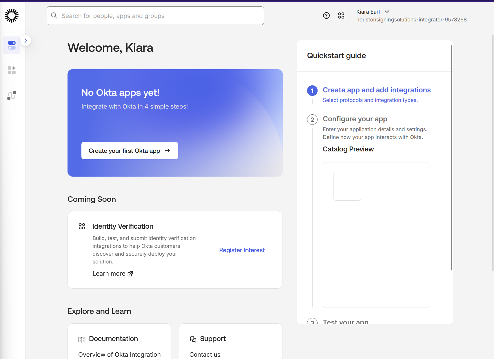
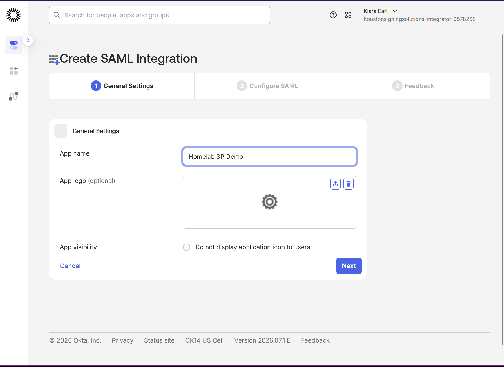
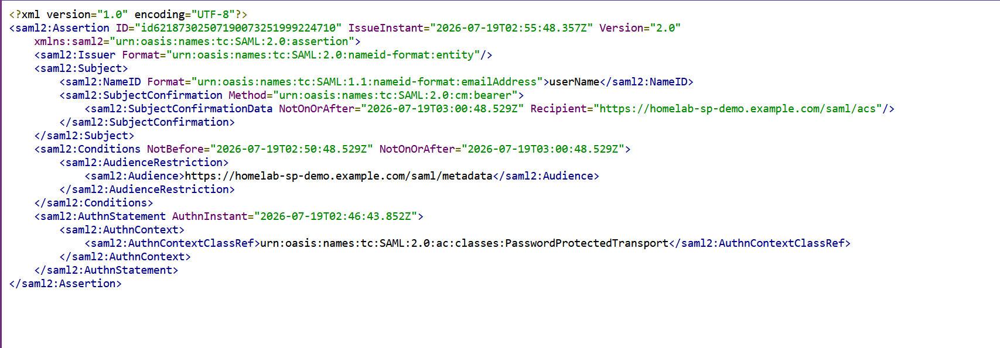
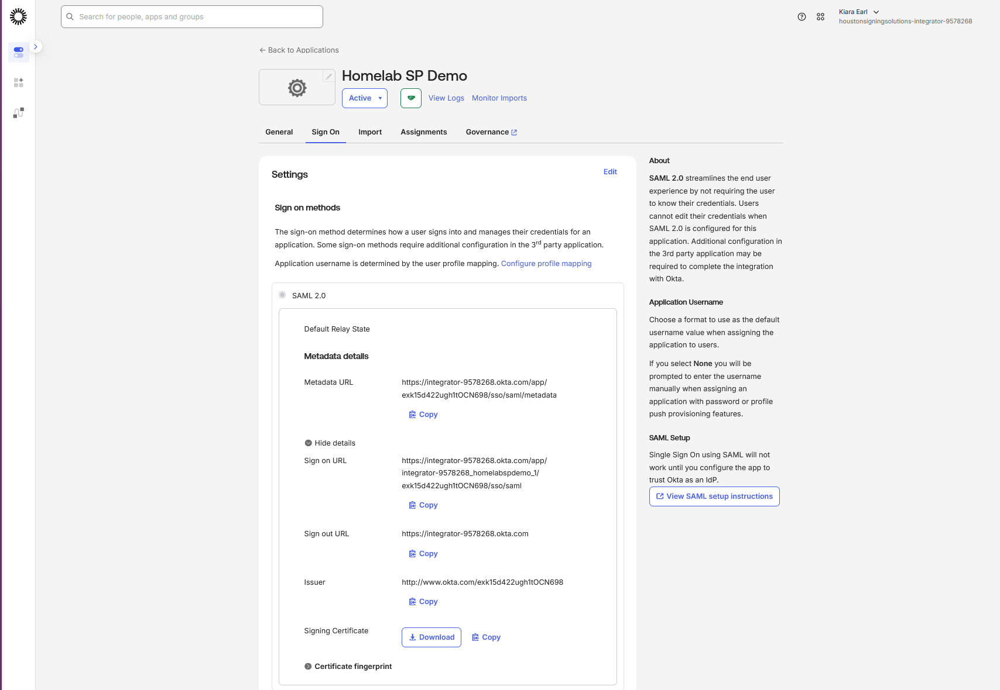
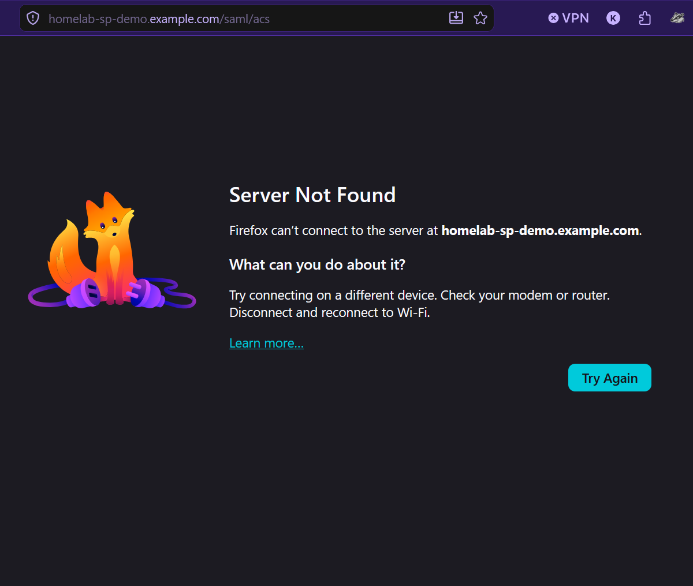

# Homelab - Exp011: SSO/SAML Dev Tenant Demo (Okta)

**Status:** ✅ Complete
**Date:** 2026-07-19
**Platform:** Okta Integrator Free Plan (dev tenant - houstonsigningsolutions.okta.com)
**Cert:** Security+ / IAM / Help Desk & Support

---

## Objective

Stand up a free Okta developer tenant, configure a SAML 2.0 application from scratch, and document the full identity provider (IdP) side of an SSO integration: app registration, SP metadata exchange (ACS URL, Entity ID), the generated SAML assertion structure, IdP metadata (SSO URL, Issuer, signing certificate), and a live login test. This is IdP-side configuration knowledge that comes up directly in Tier 1/help desk postings that reference SSO troubleshooting, since most support tickets involving SSO originate on the IdP admin side (user assigned but can't log in, wrong attribute mapping, certificate issues) rather than requiring a live third-party SP.

---

## What I Did

### 1. Okta Dev Tenant Signup

Signed up for Okta's **Integrator Free Plan** (no expiration, unlike the 30-day Okta Platform trial). Hit a real onboarding blocker worth documenting in full (see Troubleshooting): business-email requirement, a domain typo, a stuck MFA activation, and a blank-screen re-activation link. Resolved by installing the **Okta Verify desktop app for Windows** rather than relying on a phone, which unblocked account activation.

### 2. SAML 2.0 App Registration

Created a new SAML integration named **"Homelab SP Demo"** via Okta's simplified app-creation wizard (Integrator Free tenants get a streamlined 3-step flow rather than the classic admin console's full app-type catalog).

Configured the SP-side values as a fictional, non-resolving service provider (standard practice for a demo lab without a real backend app to integrate against):

| Field | Value |
|---|---|
| Single sign-on URL (ACS URL) | `https://homelab-sp-demo.example.com/saml/acs` |
| Audience URI (SP Entity ID) | `https://homelab-sp-demo.example.com/saml/metadata` |
| Name ID format | EmailAddress |
| Application username | Email |

### 3. SAML Assertion Preview

The Integrator Free wizard doesn't expose a separate Attribute Statements mapping table (see Troubleshooting), but does include a **"Preview the SAML Assertion"** feature that renders the actual XML Okta would generate for a login. Used this to verify the assertion structure: `NameID` (email format), `SubjectConfirmationData` with `Recipient` matching the configured ACS URL, `AudienceRestriction` matching the configured Entity ID, and `AuthnContextClassRef` set to `PasswordProtectedTransport`.

### 4. IdP Metadata Review

On the app's **Sign On** tab, expanded "More details" under Metadata to review the full IdP-side metadata Okta publishes for this app:

- **Sign on URL:** `https://integrator-9578268.okta.com/app/integrator-9578268_homelabspdemo_1/exk15d422ugh1tOCN698/sso/saml`
- **Sign out URL:** `https://integrator-9578268.okta.com`
- **Issuer:** `http://www.okta.com/exk15d422ugh1tOCN698`
- **Signing Certificate:** downloadable x.509 cert (also available via metadata URL as a full SAML metadata XML document)

This is the exchange a real SP admin would need from the IdP side to complete a two-way SAML trust relationship - Okta explicitly notes SSO "will not work until you configure the app to trust Okta as an IdP," confirming this is a one-sided (IdP-only) setup by design for this lab.

### 5. User Assignment and Live Login Test

Assigned my own user (Kiara Earl) to the app under the **Assignments** tab, then triggered a live login attempt from the Okta end-user dashboard (`/app/UserHome`) by clicking the app tile.

**Result:** Okta successfully generated the SAML assertion and POSTed the browser to the configured ACS URL (`homelab-sp-demo.example.com/saml/acs` - visible in the browser address bar at time of failure), then failed with a DNS/"Server Not Found" error, since that domain doesn't resolve to a real server.

This is the expected and correct outcome for a demo without a live SP: it confirms the IdP-side flow (authentication → assertion generation → redirect/POST to the registered ACS URL) worked exactly as configured. The failure point is the fictional SP, not the IdP configuration.

---

## Troubleshooting & Key Learnings

1. **Okta Integrator Free requires a business email domain** - initial signup with a personal email address was rejected outright. Had to use a domain tied to an existing business (Houston Signing Solutions) instead.
2. **Domain typo caused cascading auth failures** - a typo in the email domain during signup (`houstonsigningsolution.com` vs. the correct `houstonsigningsolutions.com`) caused "Unable to sign in" and "You do not have permission to perform the requested action" errors on every subsequent login and password-reset attempt, even after the typo was caught and corrected in the username field. The underlying org itself (`houstonsigningsolutions.okta.com`) was correctly created; the errors were specific to session/account state, not the org.
3. **MFA enrollment can strand an account mid-activation** - started MFA setup with Okta Verify but didn't have mobile app access at that moment. Re-clicking the original activation link afterward loaded a blank white screen (likely a single-use link + broken session state), and Forgot Password returned a permission error rather than completing - a strong signal the account was stuck in an incomplete-enrollment state rather than a simple credential issue.
4. **Resolution: Okta Verify has a Windows desktop client**, not just mobile. Installing it directly on the lab machine and retrying login completed MFA enrollment and fully unblocked the account - no support ticket needed in the end, though one was drafted as a fallback (documenting the account state clearly: org, email, and the specific error sequence) in case the desktop client hadn't worked.
5. **Integrator Free's SAML wizard omits the classic Attribute Statements section.** The simplified 3-step app-creation flow (General Settings → Configure SAML → Feedback) doesn't expose the attribute-mapping table found in Okta's full admin console. Worked around this by using the built-in "Preview the SAML Assertion" feature to confirm assertion structure and default (unmapped) NameID behavior instead.
6. **A field-order mistake during config** - initially entered the Entity ID value into the Single sign-on URL field by mistake (order matters, ACS URL and Entity ID are visually similar in this wizard). Caught by re-reading the field labels against the values entered, not by an error message - a reminder that SAML misconfigurations are often silent rather than validated at entry time, which is exactly why the assertion preview and metadata review steps matter for verification.

---

## Verification

- SAML app "Homelab SP Demo" created and active in Okta Integrator Free tenant
- ACS URL and SP Entity ID correctly configured (after catching and fixing the field-order mistake)
- SAML assertion preview confirmed correct NameID, SubjectConfirmationData/Recipient, and AudienceRestriction values matching configured SP settings
- IdP metadata (Sign on URL, Sign out URL, Issuer, signing certificate) reviewed and captured
- User assigned to app; live login test confirmed Okta correctly generates and POSTs the assertion to the configured ACS URL
- Expected failure at the fictional SP endpoint documented as the correct outcome, not a misconfiguration

---

## Key Concepts

| Concept | What It Demonstrates |
|---|---|
| SAML 2.0 | XML-based SSO protocol; assertions exchanged between IdP and SP |
| IdP vs. SP | Okta as Identity Provider; the (fictional) app as Service Provider |
| ACS URL | Where the IdP sends the SAML assertion after successful auth |
| Entity ID / Audience Restriction | Identifies which SP an assertion is valid for |
| SP/IdP metadata exchange | Certificates and endpoint URLs both sides need to establish trust |
| NameID / SubjectConfirmation | How the IdP asserts identity within the SAML response |
| Business-email gating on IdP dev tenants | Common real-world onboarding friction for SSO admin tools |

---

## Why This Matters for Support/Help Desk & IAM Roles

SSO/SAML shows up directly in Tier 1 support and IAM-adjacent postings - not as "build an SP," but as "understand what's happening on the IdP side when a user can't log into a federated app." This lab covers the parts of that picture a Tier 1 analyst or help desk tech actually touches:

- **Assigning users to apps** and understanding that assignment ≠ working SSO if the SP-side trust isn't configured
- **Reading IdP metadata** (Issuer, SSO URL, certificate) - the values a vendor support team will ask for when troubleshooting a broken federation
- **Recognizing silent misconfiguration** - SAML errors are often not caught at config time, only at login time, which is why verification steps (assertion preview, metadata review) matter as a habit, not just a one-time setup step
- **Real account/access troubleshooting** - the Okta onboarding issues (stuck MFA enrollment, domain mismatch, permission errors) are themselves realistic support scenarios, diagnosed the same way a Tier 1 ticket would be: narrowing down whether it's a credential issue, a session/state issue, or an account provisioning issue

---

## Cert Connections

| Cert | Objective |
|---|---|
| Security+ | Federated identity, SSO/SAML, PKI (signing certificates) |
| Network+ | DNS resolution failures (the expected ACS test outcome) |
| Help Desk / Support | SSO troubleshooting, account activation/MFA issues, ticket-style root-causing |

---

## Related Notes

- [[Homelab-Exp006-AD-DS|Active Directory DS]] - the on-prem IAM counterpart to this cloud IdP
- [[Homelab-Exp007-Azure-Sentinel|Azure Sentinel]] - other cloud identity/security tooling in the lab
- [[Homelab-Lab-Notes|Home Lab Notes]]
- [[Cybersecurity-SOC-Path]]
- [[MOC-Home-Lab]]

## GitHub
https://github.com/kiaraearl/homelab-build/tree/main/experiments/Exp011
