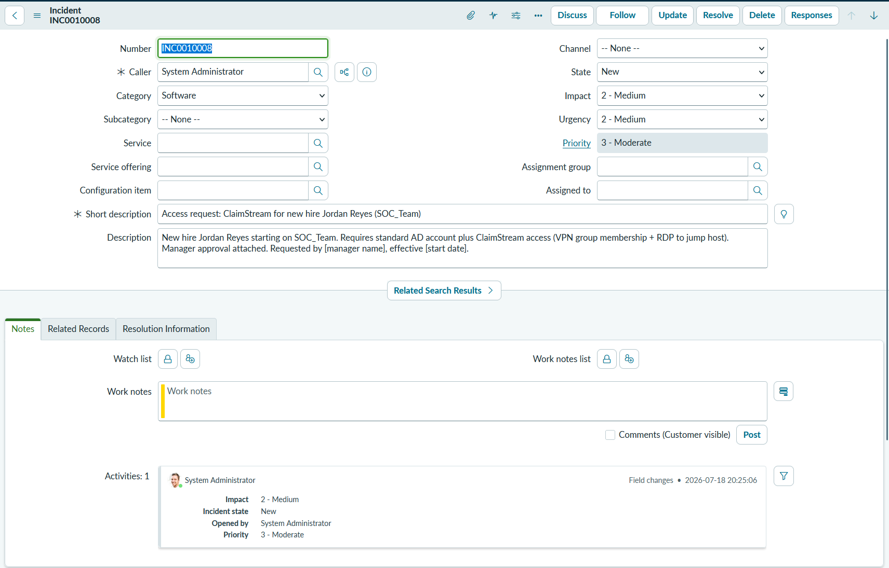
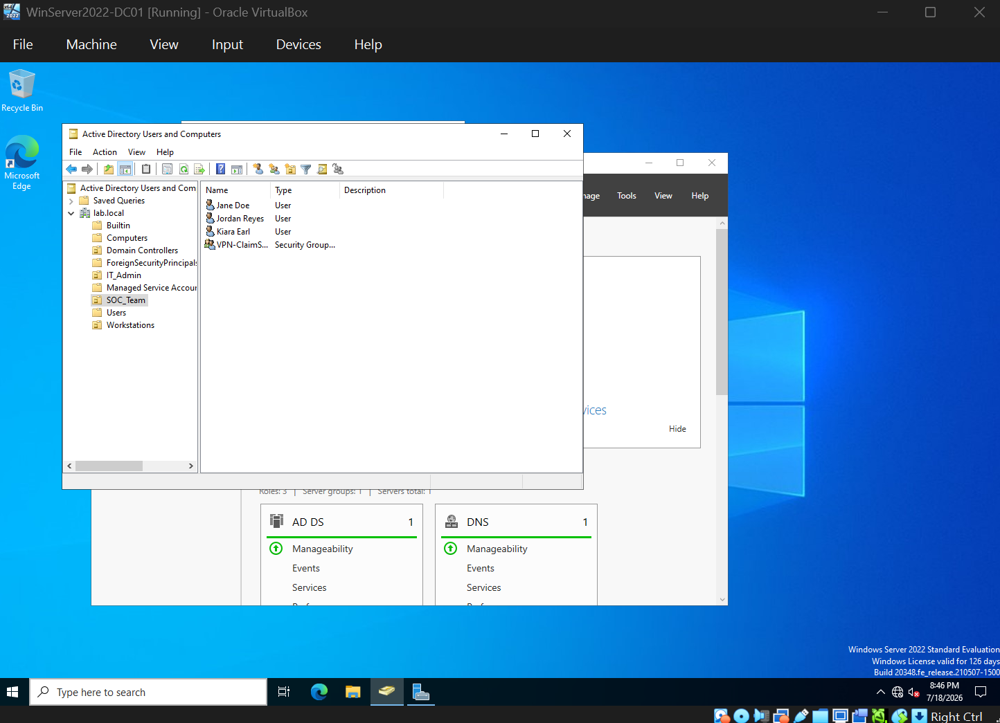
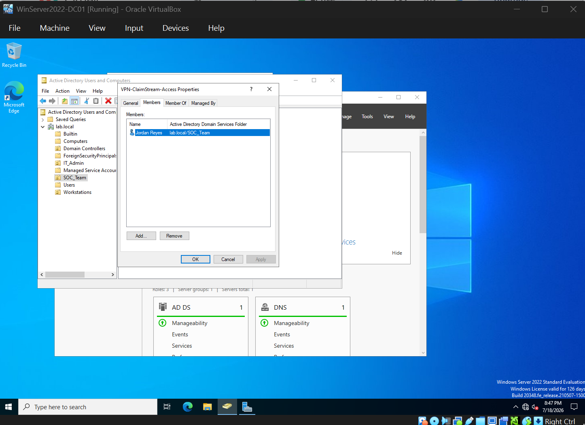
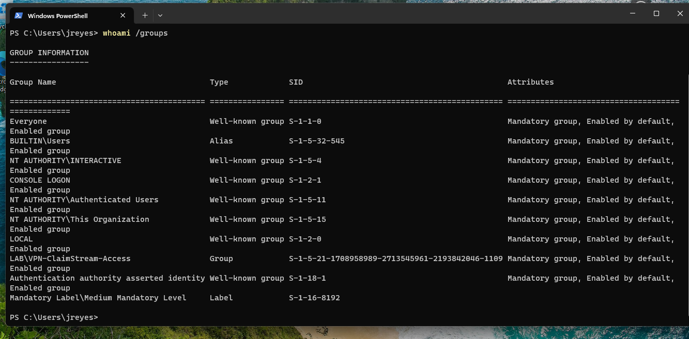
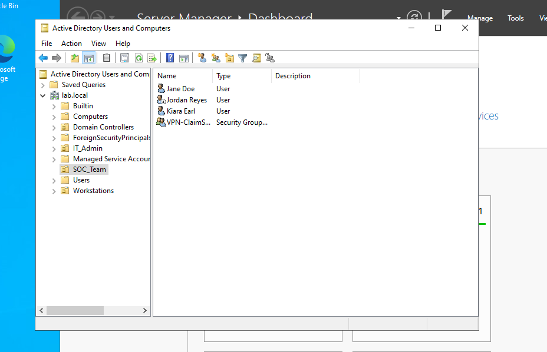
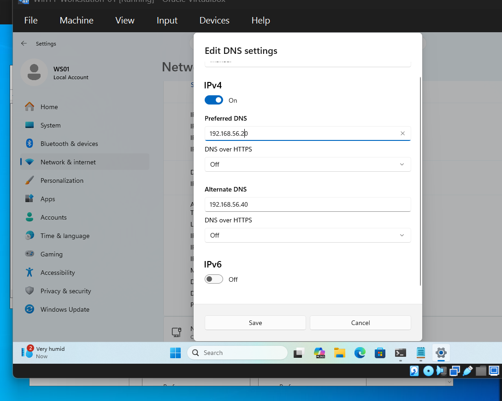

# Homelab - Exp012: IAM Access Request Workflow (Onboarding & Offboarding)

**Status:** Complete
**Date:** 2026-07-18
**Systems:** WinServer2022-DC01 (192.168.56.20 - AD DS), Win11-WS01 (192.168.56.30 - target workstation), Pihole-01 (192.168.56.40), ServiceNow PDI (dev400535.service-now.com)
**Cert:** Security+ / IAM / Help Desk & Support

---

## Objective

Document a full, realistic access request lifecycle for provisioning and later deprovisioning a user to a third-party platform - request intake, identity verification, provisioning (AD account + access group), live access verification, and formal offboarding - using a fictional third-party platform ("ClaimStream") accessed via VPN/jump-host rather than direct login. This builds directly on [Exp006](../Exp006/exp006-active-directory.md)'s AD/lab.local foundation and mirrors the shape of IAM-adjacent support tickets (including EMR-style access requests) common in Tier 1/help desk postings, without naming a specific regulated platform.

---

## Scenario

New hire **Jordan Reyes** joins the **SOC_Team** OU and requires:
- A standard AD account
- Access to **ClaimStream**, a fictional third-party case management platform reached via VPN group membership + RDP to a jump host (not direct internet-facing login) - representative of how many regulated or vendor-hosted platforms are actually accessed in practice
- Manager approval prior to provisioning

---

## What I Did

### Stage 1 - Scenario & Request Intake

Opened a ServiceNow incident (**INC0010008**) to represent the access request: short description, category (Software - closest available default category to "access/provisioning" in this PDI), and a description capturing the requester, the new hire's team, the specific access needed, and manager approval context.



### Stage 2 - Identity Verification

Before provisioning anything, documented the verification checks a real request should pass:

| Check | How it's verified | Result |
|---|---|---|
| Requester authority | Confirm request came from the manager, not self-requested | Manager-initiated per ticket |
| Role match | Confirm SOC_Team OU is the correct placement for the stated role | New hire role = SOC Analyst, matches OU purpose |
| Least privilege | Confirm requested access (ClaimStream via VPN group) is the minimum needed, not broader/admin access | Standard analyst-tier access only |
| Duplicate account check | Confirm no existing AD account already exists for this person | Verified empty search result in ADUC before creation |
| Approval trail | Manager approval documented in the ticket | Captured in ticket description |

This is the reasoning layer between "a ticket exists" and "an account gets created" - the step most likely to get skipped under time pressure, and the one auditors/compliance reviews actually check for.

### Stage 3 - Provisioning

In ADUC on DC01:
- Created **Jordan Reyes** (`jreyes`) in the **SOC_Team** OU, with "User must change password at next logon" enforced
- Created a new security group, **VPN-ClaimStream-Access**, and added Jordan as a member - representing the group-based access grant a real jump-host/VPN gateway would check against





### Stage 4 - Access Verification (Live Test)

Rather than only documenting the *expected* verification step, ran it live: attempted an RDP login to WS01 as `jreyes@lab.local`, then confirmed the access grant was actually active (not just configured) via:

```
whoami /groups
```

Output confirmed `LAB\VPN-ClaimStream-Access` present in Jordan's access token.



### Stage 5 - Offboarding Request & Deprovisioning

Resolved the onboarding ticket first (INC0010008 - "Solved (Permanently)," with a resolution note summarizing what was provisioned and how it was verified), then opened a **separate** offboarding ticket (**INC0010009**) rather than reusing or repurposing the original - matching how a real environment tracks onboarding and offboarding as distinct, independently auditable events rather than one open-ended request.

In ADUC:
- Disabled Jordan Reyes' AD account
- Removed Jordan from **VPN-ClaimStream-Access**



### Stage 6 - Offboarding Closure

Resolved INC0010009 with a resolution note confirming the account was disabled and access group membership revoked, closing the loop on the full lifecycle.

---

## Troubleshooting & Key Learnings

This lab surfaced a genuine, multi-step troubleshooting scenario during Stage 4's access verification - not manufactured, discovered mid-lab:

1. **"Domain isn't available" on RDP login despite the target and DC being pingable.** Initial RDP attempt to WS01 failed with a domain-unavailable error even though `ping 192.168.56.20` (DC01) succeeded cleanly. Root cause, found via `ipconfig /all`: WS01's primary DNS server was pointed at **Pi-hole** ([Exp008](../Exp008/exp008-pihole-dns-sinkhole.md), 192.168.56.40) rather than DC01. Domain authentication depends on DNS to *locate* the domain controller (SRV records, not just basic name resolution) - Pi-hole only forwards to its upstream (Cloudflare) and has no knowledge of `lab.local`'s internal AD records. Full network reachability (ping) does not imply domain discoverability - a distinction that matters directly for real "I can't log in but the network's fine" tickets.
   - **Fix:** set WS01's preferred DNS to `192.168.56.20` (DC01), keeping Pi-hole as a secondary/alternate DNS server so ad-blocking is preserved for general browsing without breaking domain lookups.


2. **Wrong domain-login delimiter.** After the DNS fix, login still failed with "user name or password is incorrect" - not a DNS issue this time, but the username was entered as `lab.local/jreyes` (forward slash). Windows domain logins require either `DOMAIN\username` (backslash, NetBIOS style) or `username@domain` (UPN style) - a forward slash is silently treated as part of an invalid username string rather than a domain separator.
3. **VM resource contention causing an apparent freeze.** After both fixes, login succeeded ("Welcome" screen) but hung significantly longer than expected during first-time domain profile creation. Traced to DC01 itself being under load at that moment (multiple lab VMs running concurrently) rather than a configuration problem - resolved on its own once DC01's load settled. Worth noting as a reminder that not every slow/stuck symptom during a live troubleshooting session is a misconfiguration; ruling out host-level resource contention is itself a valid diagnostic step before re-touching configuration.

Together these three issues moved in sequence exactly like a real ticket would: network layer (ruled out - ping worked) → DNS/name resolution layer (found and fixed) → credential/syntax layer (found and fixed) → performance/resource layer (identified, no config change needed). That layered elimination process is the actual skill being demonstrated, more so than any single fix.

---

## Verification

- INC0010008 (onboarding) and INC0010009 (offboarding) both created and resolved as separate, auditable tickets
- Duplicate-account check performed before provisioning
- AD account and access group created correctly in the SOC_Team OU
- Live RDP login test performed (not just documented) - confirmed working after resolving DNS and username-format issues
- Access grant confirmed active in the user's token via `whoami /groups`, not just present in AD configuration
- Account disabled and group membership removed on offboarding, verified in ADUC

---

## Key Concepts

| Concept | What It Demonstrates |
|---|---|
| Access request lifecycle | Intake → verification → provisioning → verification → deprovisioning as distinct, auditable stages |
| Least privilege | Granting only the specific access needed (one group), not broad/admin rights |
| Group-based access control | Using AD security groups to gate access to an external system, rather than per-user configuration |
| Separation of onboarding/offboarding tickets | Two independent, closeable records instead of one open-ended request |
| DNS's role in domain authentication | Ping success ≠ domain discoverability; SRV/DNS resolution is a separate dependency from raw connectivity |
| Layered troubleshooting | Network → DNS → credentials → performance, eliminated in order rather than guessed at randomly |

---

## Why This Matters for Support/Help Desk & IAM Roles

This is the workflow shape that sits behind most "user can't access [third-party system]" tickets, and behind EMR-style or other regulated-platform access requests specifically: an AD account existing doesn't mean access works end-to-end, and access existing on paper (group membership configured) doesn't mean it's actually active until verified in a live session. The DNS troubleshooting sequence in Stage 4 is realistic, not staged - the kind of issue that looks like "the domain is broken" at first glance but is actually a single mispointed DNS setting, which is exactly the kind of fast, layered diagnosis a Tier 1 analyst or IAM-adjacent support tech needs to demonstrate. Tracking onboarding and offboarding as two separate, fully-closed tickets also reflects how access reviews and compliance audits actually expect this to be documented - not as one long-running request.

---

## Cert Connections

| Cert | Objective |
|---|---|
| Security+ | Identity and access management, least privilege, account lifecycle management |
| Network+ | DNS resolution and its role in name-based service discovery |
| Help Desk / Support | Layered troubleshooting methodology, ticket lifecycle documentation |

---

## Related Experiments

- [Exp006 — Active Directory](../Exp006/exp006-active-directory.md) - the AD foundation this lab provisions against
- [Exp008 — Pi-hole DNS Sinkhole](../Exp008/exp008-pihole-dns-sinkhole.md) - the DNS server that caused the domain-discovery issue
- [Exp009 — CIC Incident Operations](../Exp009/sitrep-template.md)
- [Exp011 — SSO/SAML Dev Tenant Demo (Okta)](../Exp011/exp011-SSO-SAML.md) - the IdP-side counterpart to this on-prem AD access workflow

## GitHub
https://github.com/kiaraearl/homelab-build/tree/main/experiments/Exp012
