# Homelab - Exp013: Zendesk Support Operations Lab

**Status:** Complete
**Date:** 2026-07-19
**Systems:** Zendesk Suite Professional Trial (cloud/SaaS, technovasolutionssupport.zendesk.com)
**Cert:** Security+ / Help Desk & Support / SOC

---

## Objective

Configure a Zendesk support environment from scratch - ticket structure, SLA policy, escalation automation, canned responses, a published knowledge base article, and reporting - then simulate a full ticket lifecycle across three realistic support scenarios. Built specifically to demonstrate Zendesk configuration-level fluency (not just end-user ticket handling) for the MacStadium Technical Support Specialist posting, which names Zendesk directly as a required ticketing tool.

---

## Scenario

**TechNova Solutions**, a fictional SaaS company, stands up a Zendesk instance to run its support operations. Three customer tickets are simulated end-to-end, each representing a distinct real-world support pattern:
- A billing bug requiring escalation to engineering
- A how-to question resolved by pointing the customer to documentation
- An urgent, organization-wide outage requiring rapid triage and escalation

All three run through the same configured environment - custom fields, SLA targets, triggers, automations, and macros - to demonstrate that the environment behaves correctly under realistic conditions, not just in isolated configuration screens.

---

## What I Did

### Stage 1 - Account Setup & Environment Configuration

Started the Zendesk Suite Professional 14-day trial under company name **TechNova Solutions**, landing on subdomain `technovasolutionssupport.zendesk.com`. Configured a business hours schedule (**TechNova Standard Hours**, Mon-Fri 8 AM-6 PM Central) to anchor all later SLA and automation timing.

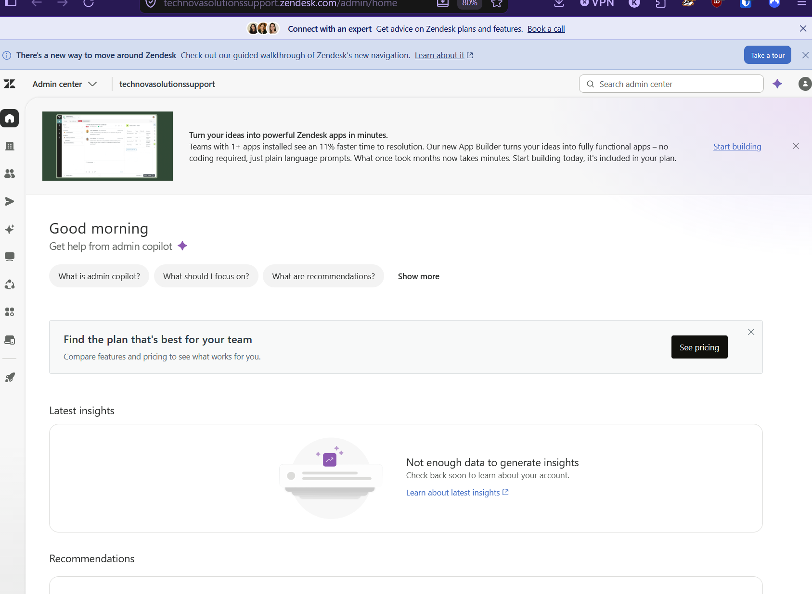

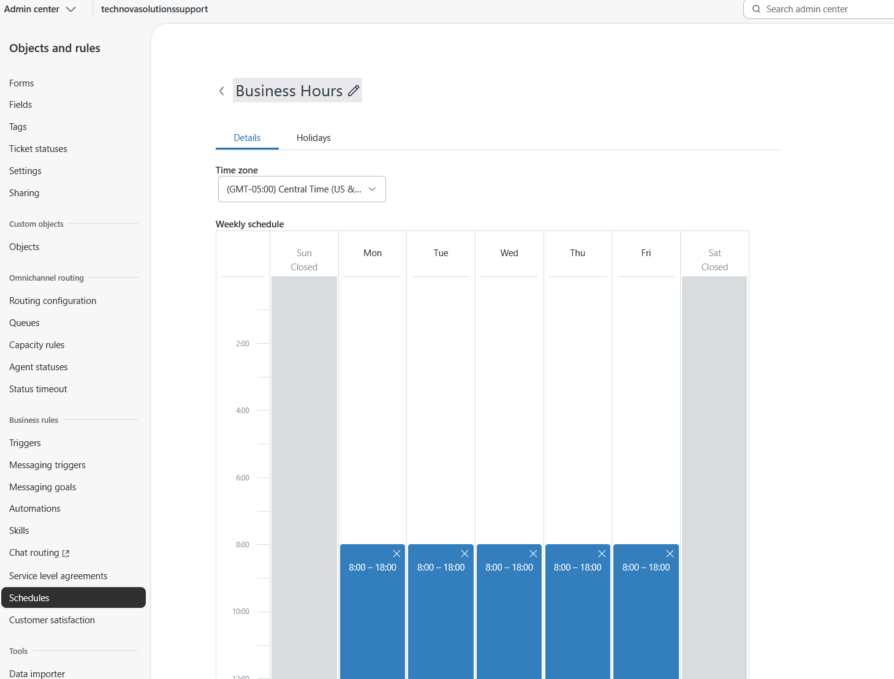

### Stage 2 - Ticket Structure: Fields, Form & Views

Built three custom ticket fields (Product Area, Issue Type, Number of Affected Users) and a custom ticket form (**TechNova Support Request**) combining them with the default Subject, Description, and Priority fields. Created four views to organize the support queue: All Open Tickets, High Priority — Needs Attention, Pending Customer Response, and a fourth view I added beyond the original plan, **Solved Tickets**, to give the ticket lifecycle a visible closing stage.

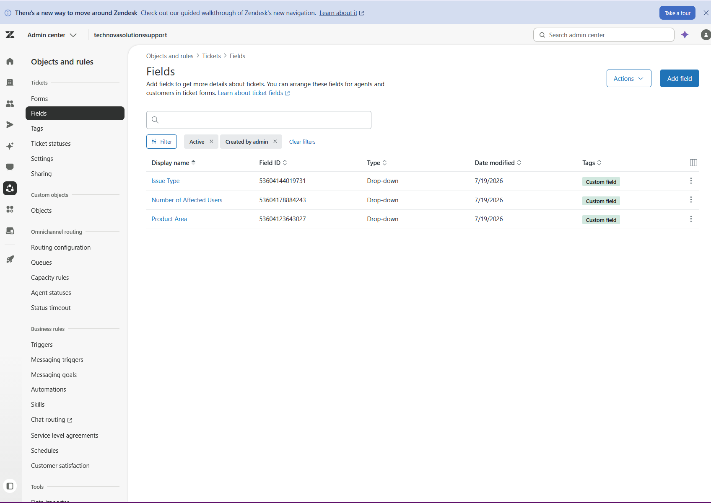

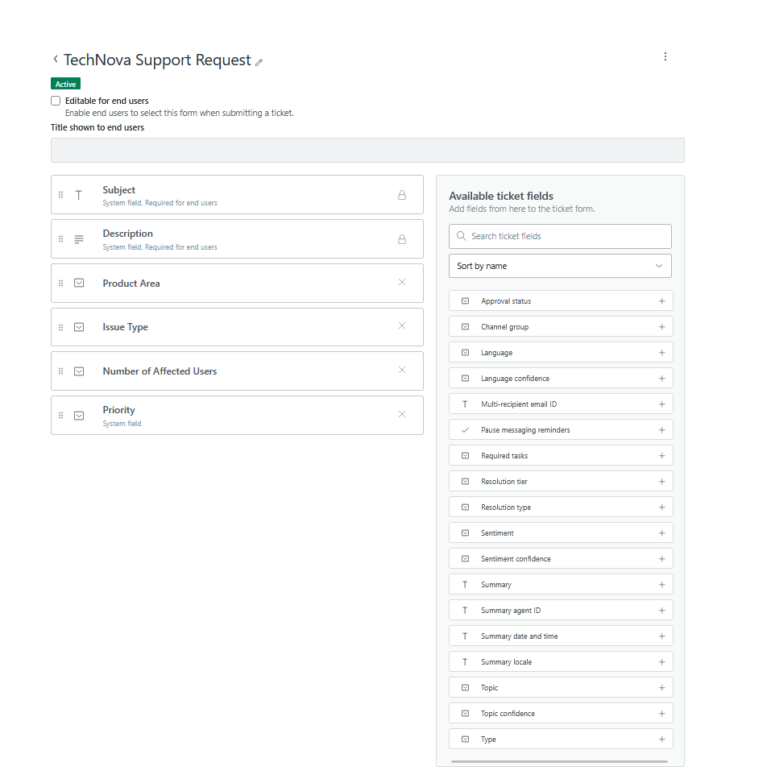

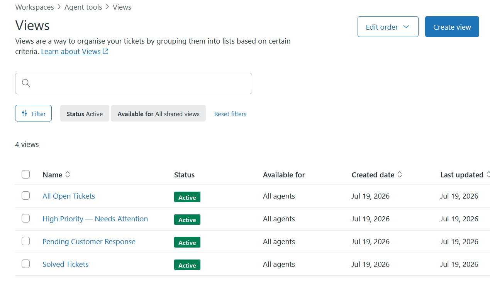

### Stage 3 - SLA Policy

Configured **TechNova Standard SLA** with four priority tiers, covering both First Reply Time and Total Resolution Time, scoped to business hours rather than calendar hours so overnight/weekend time doesn't count against the target.

| Priority | First Reply Target | Resolution Target |
|---|---|---|
| Urgent | 1 hour | 4 hours |
| High | 4 hours | 24 hours |
| Normal | 8 hours | 48 hours |
| Low | 24 hours | 5 business days |

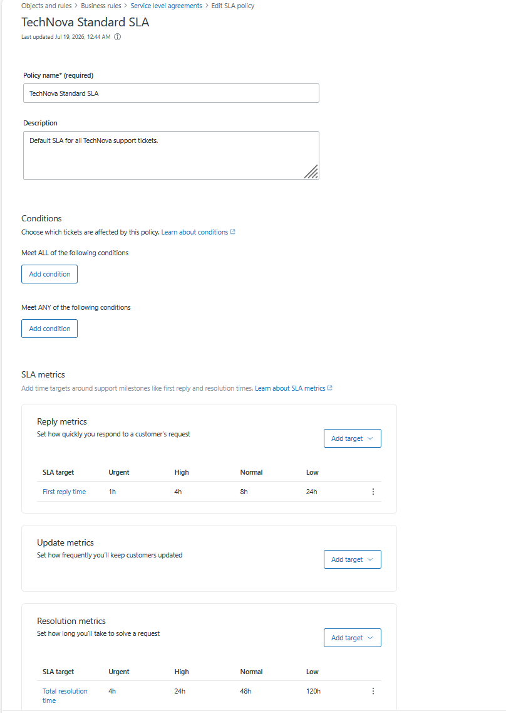

### Stage 4 - Triggers & Automations (Escalation Workflows)

Built three triggers to automate immediate actions on ticket create/update events, and two automations to run on a schedule against elapsed-time conditions:

**Triggers:**
- Tag - Bug Reports (auto-tags and reprioritizes tickets where Issue Type is Bug/Error)
- Notify - Urgent Ticket Created (emails the assignee when an Urgent ticket is created)
- Status - Pending After Agent Reply (moves status to Pending after an agent posts a comment)

**Automations:**
- Follow-Up - Pending Ticket (48 hours) - nudges the customer and reopens the ticket if it's sat Pending too long
- Auto-Close - Solved Tickets (7 days) - closes tickets that have remained Solved with no further activity

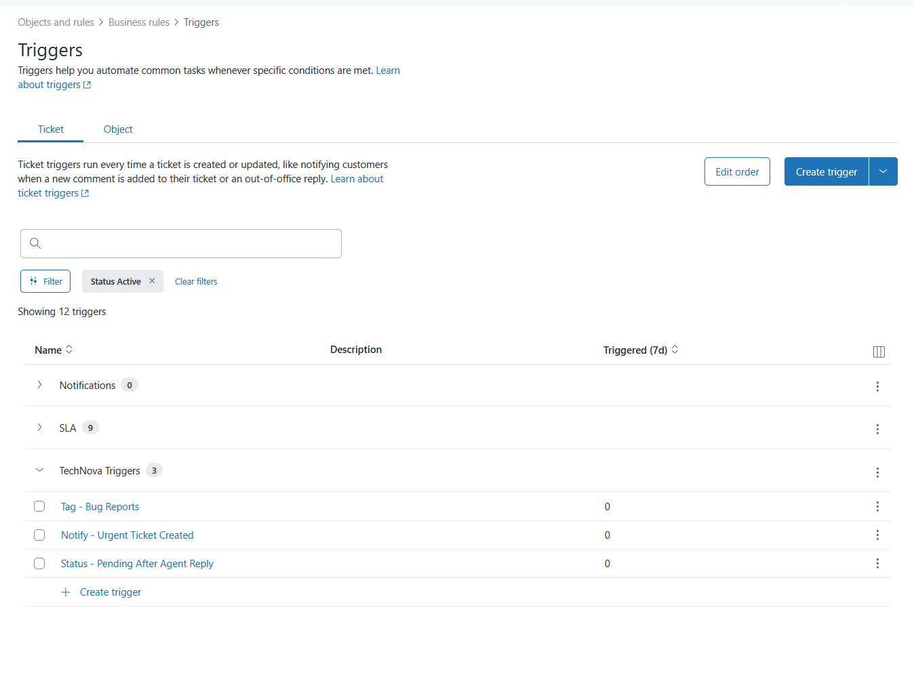

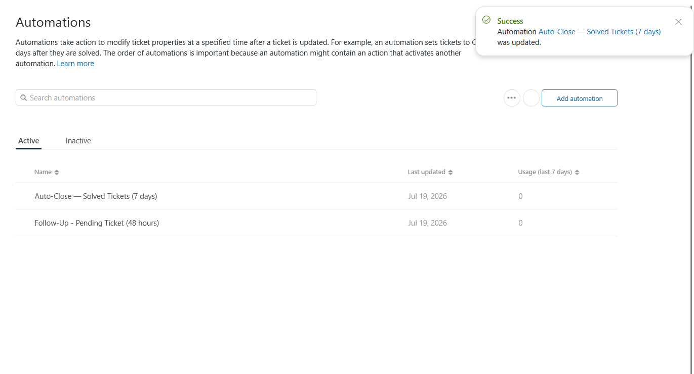

### Stage 5 - Macros (Canned Responses)

Built four macros covering the core support interaction pattern: acknowledge, request more information, escalate internally, and resolve.

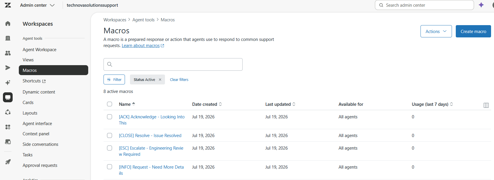

### Stage 6 - Knowledge Base Article

Published a Help Center article, **"How to Export Your Donation Report to Excel or CSV,"** under a new How-To Guides section, visible to all end users - added specifically so Scenario B's resolution could reference real documentation instead of restating instructions inline.

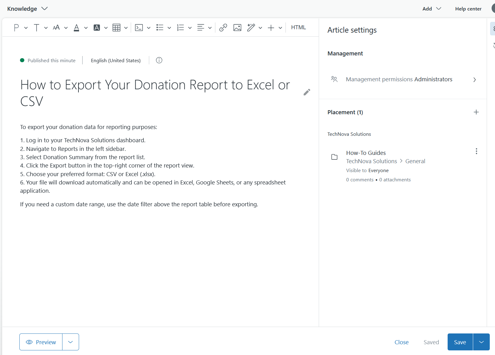

### Stage 7 - Full Ticket Lifecycle Simulation

Ran three realistic support scenarios end-to-end, each submitted as the customer (Alex Wiltz) and worked as the agent (Kiara Earl):

**Scenario A - Billing Bug (High Priority, Escalated).** Customer reported being double-charged $149. Acknowledged, added an internal note confirming the duplicate charge in billing logs, escalated to engineering via macro (auto-tagged `escalated` + `engineering-review`, priority bumped to Urgent), replied publicly confirming the refund, and closed.

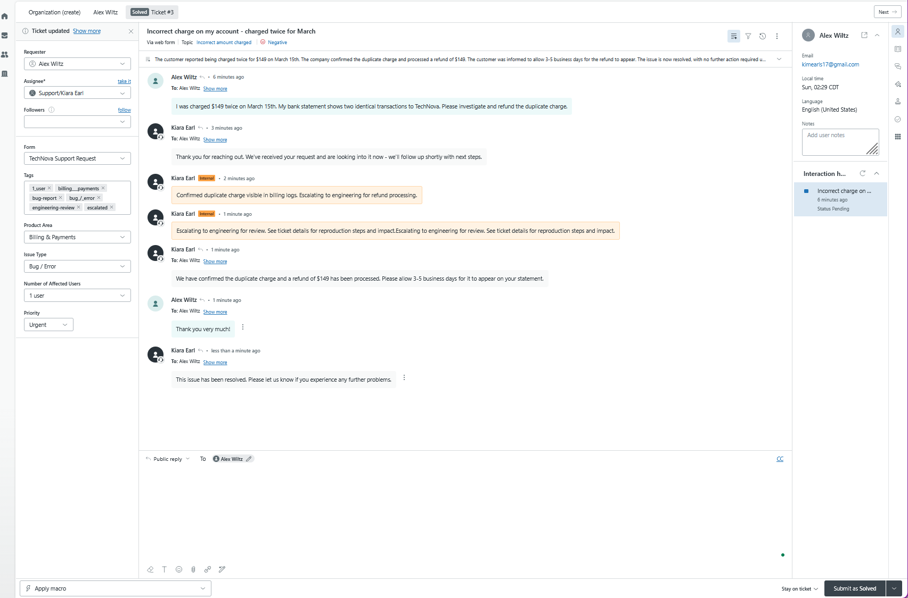

**Scenario B - How-To Question (Normal Priority, Self-Resolved).** Customer asked how to export a donation report. Acknowledged, requested clarifying detail and received a real customer reply before answering - a step I added beyond the original script, since applying an information-request macro without a corresponding customer reply understated what that macro is for. Resolved by linking directly to the newly published KB article rather than retyping the steps.

**Scenario C - Urgent Org-Wide Outage (Urgent, Multi-Step).** Customer reported a full organization lockout ahead of a time-sensitive event. Acknowledged, added an internal note documenting scope and urgency, escalated via macro, sent a public reply setting expectations, then - after confirming resolution - waited for the customer's own confirmation reply before closing, so the ticket documents verified resolution rather than an assumed one.

### Stage 8 - Reporting

Zendesk Explore (the advanced analytics tool) required a multi-hour provisioning window not available within the trial session. Fell back to manual reporting via the Views sidebar counts instead.

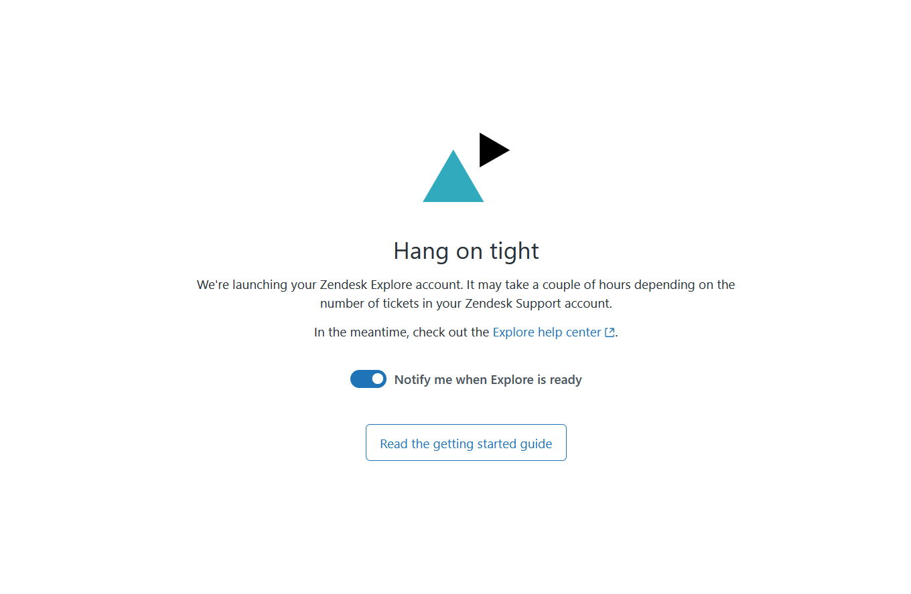

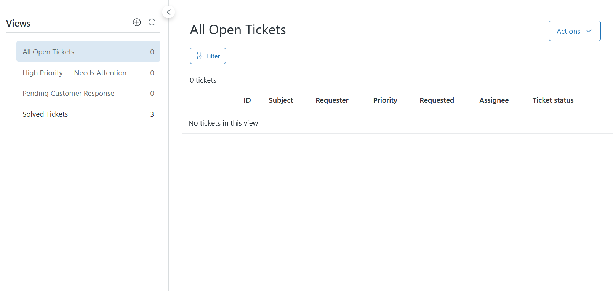

---

## Troubleshooting & Key Learnings

This lab surfaced several genuine configuration issues during live testing - not manufactured, found mid-lab:

1. **Guide/Help Center not reachable at the expected path.** The Help Center 404'd at `/hc` despite Guide being active on the account. Root cause: the redesigned Admin Center navigation doesn't surface a direct link to Guide's classic admin panel. Found working access via the direct URL `/knowledge/admin`, and separately via the product switcher's **Knowledge** entry once located.
2. **View logic error - ALL vs. ANY.** The High Priority — Needs Attention view was initially built with two Priority conditions (High, Urgent) both placed in the "Meet ALL" block - logically impossible, since a ticket can only carry one priority value at a time, meaning the view would have matched zero tickets. Fixed by moving both conditions into the "Meet ANY" block, correcting the logic to Status Open AND (Priority High OR Priority Urgent).
3. **End-user form fields not surfacing on submission.** A ticket submitted via the customer-facing Help Center form arrived with all custom fields blank, despite those fields being present on the ticket form. Root cause was the "Editable for end users" checkbox being unticked on the form. Rather than reconfigure and resubmit mid-scenario, I set the fields directly as the agent on a fresh ticket - a plausible real workflow (an agent categorizing an incoming request the intake form failed to capture correctly).
4. **Session conflict between agent and customer logins.** Signing up as an end user in the same browser tab as the active agent session logged out the agent account, since Zendesk end-user and agent sessions share cookies per browser context. Resolved by keeping agent and customer sessions in fully separate browser windows for the remainder of the lab.
5. **No automatic priority escalation from ticket content.** Scenario C's submission form didn't expose a Priority field to the end user, and no trigger in this configuration reads ticket description text to infer urgency. A ticket describing a full organizational outage therefore landed at default priority with no auto-escalation. I manually escalated it as the agent - arguably the more accurate simulation, since production support tools generally reserve priority-setting for agents rather than customers, and nothing should auto-trust a customer's self-reported urgency without a human or a keyword-matching trigger doing the elevating.

Together these surfaced issues moved across distinct layers - navigation/access, view logic, form configuration, session handling, and escalation logic - and each was diagnosed and resolved (or deliberately worked around) rather than glossed over. That diagnostic process, more than any single fix, is the actual skill being demonstrated.

---

## Verification

- All three ticket scenarios created, worked, and resolved to Solved status
- SLA policy applied with correct business-hours scoping across all four priority tiers
- Trigger fire confirmed live: Tag - Bug Reports correctly auto-tagged and reprioritized a ticket submitted with Issue Type = Bug/Error at creation time
- View logic bug caught and corrected before being left in a broken state
- KB article published and referenced live in a real ticket resolution, not just created and left unused
- Manual reporting fallback confirmed queue was fully cleared (0/0/0) with all three scenarios landing in Solved (3)

---

## Key Concepts

| Concept | What It Demonstrates |
|---|---|
| SLA policy design | Tiered response/resolution targets scoped to business hours vs. calendar hours |
| Trigger vs. automation | Triggers fire immediately on create/update events; automations run on a schedule against elapsed-time conditions |
| Trigger timing limitation | A trigger conditioned on "Ticket Is Created" only evaluates fields present at creation time - it does not retroactively fire when those fields are edited afterward |
| Macro design (public vs. internal) | Public replies vs. internal notes, and the operational importance of not exposing internal escalation language to the customer |
| ALL vs. ANY condition logic | A common, real misconfiguration pattern in views/triggers - conflating "must match every condition" with "must match any one of these" |
| Escalation workflow | Tagging and reprioritizing tickets to route toward engineering review, distinguishing an agent-driven urgency judgment from an unverified customer-stated one |
| Knowledge base integration | Resolving tickets by referencing real documentation rather than retyping instructions inline |

---

## Why This Matters for Support/Help Desk & SOC Roles

The MacStadium Technical Support Specialist posting names Zendesk directly as a required tool, and this lab demonstrates configuration-level familiarity with it - building the ticket structure, SLA policy, and escalation automation a support team actually relies on, not just end-user ticket submission. The troubleshooting encountered along the way is arguably the most interview-relevant part of the lab: a logic bug in view conditions, a form field misconfiguration, a session-handling quirk, and a missing auto-escalation path are all the kind of real, unscripted problems a Tier 1 support or SOC analyst has to diagnose and work around under time pressure, not just follow a checklist toward a clean, pre-verified result.

---

## Cert Connections

| Cert | Objective |
|---|---|
| Security+ | Access control patterns (public vs. internal visibility), incident escalation workflow |
| Help Desk / Support | Ticketing system configuration, SLA management, macro/canned response design |
| SOC | Escalation triage, distinguishing verified from unverified severity/urgency signals |

---

## Related Experiments

- [Exp009 — CIC Incident Operations](../Exp009/sitrep-template.md) - the ticket lifecycle and escalation documentation pattern this lab builds on, applied to a commercial ticketing platform instead of ServiceNow
- [Exp012 — IAM Access Request Workflow](../Exp012/exp012-IAM-Access-Workflow.md) - the layered troubleshooting methodology (network → DNS → credentials → performance there; navigation → logic → form config → session → escalation logic here) carried into a different tool

## GitHub
https://github.com/kiaraearl/homelab-build/tree/main/experiments/Exp013
